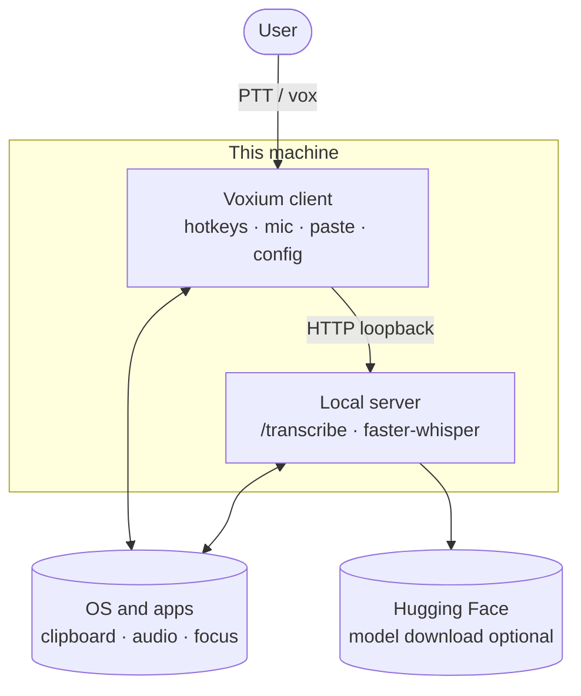
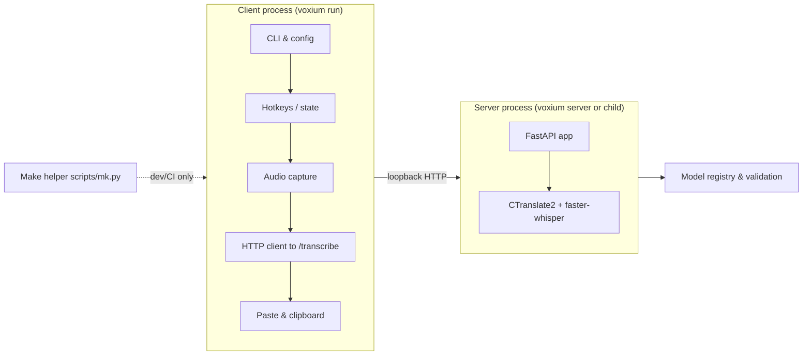
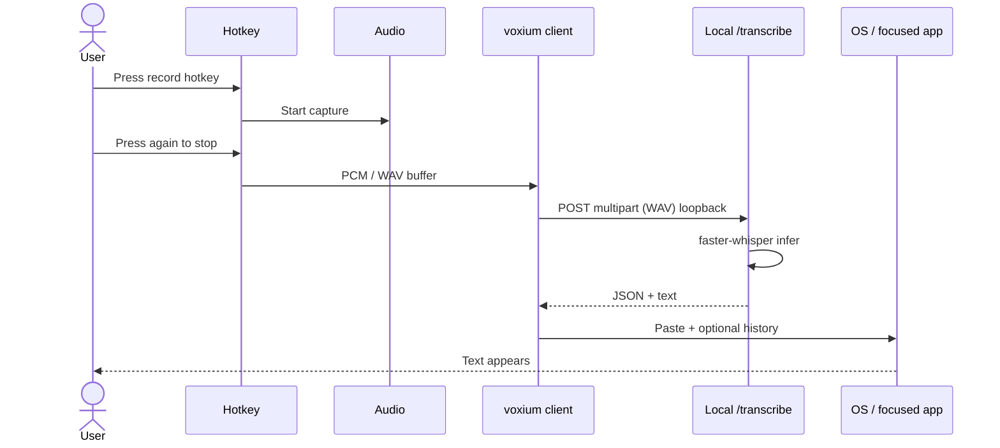
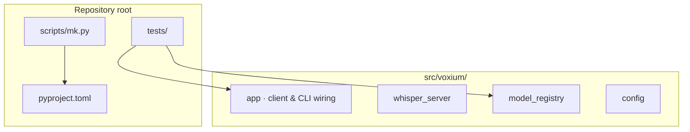
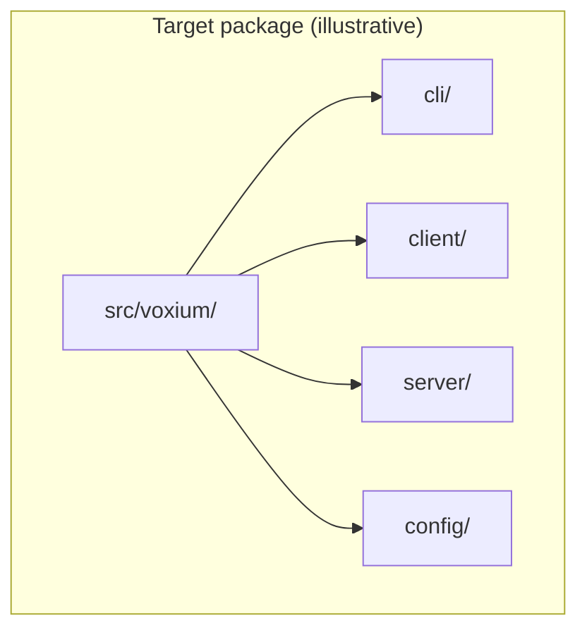

# Voxium architecture

This document describes how **Voxium 0.0.1** is structured: who uses it, which **stack** parts exist, how a **PTT** (push-to-talk) **vox** flow becomes text, and how the **repository** maps to that path. The tone in diagram labels follows [brand.md](brand.md) — *radio* clarity plus **Apollo**-era “first local integration” of people, **hardware** (mic, GPU/CPU), **software** (client, model), and **robot** automation (inference) on the loop. Written for **maintainers and contributors** (see [testing](testing.md) for tests and coverage).

---

## 1. System context

Voxium is **local-first** **PTT** voice: the user runs a **client**; when possible a **local HTTP** worker (faster-whisper / CTranslate2) on the same machine does **/transcribe** only on **loopback** — a **vox** path with no cloud in the product pipeline.

*(Standard Mermaid; renders on GitHub and most Mermaid 9+ previewers.)*

**Design constraints (product):**

- Transcription **URL must be loopback** (enforced in the client).
- **Default inference path** is **GPU (CUDA)** where available; **CPU** is a supported mode via CLI / config.
- **Privacy:** raw audio and text stay on the machine; the only routine external use is **model download** from trusted Systran repositories (see `voxium.model_registry`).

---

## 2. Logical components

The product code lives in **`src/voxium/`** (installed as the `voxium` package). The diagram below is **logical**—it shows responsibilities; module names in the table are the on-disk / import paths to use in docs and tests.

| Logical area | Current modules (indicative) | Role |
|--------------|--------------------------------|------|
| **CLI & run loop** | `voxium.app` (argparse, `run`, hotkeys) · entry: `voxium` / `python -m voxium` | User entry, spawns or reuses local server. |
| **Local server** | `voxium.whisper_server` | FastAPI, `/transcribe`, model load, metrics. |
| **Trusted models** | `voxium.model_registry` | Allow-list and repo resolution for Systran models. |
| **Config** | `voxium.config` (`VoxiumUserConfig`) | YAML at `~/.config/voxium/config.yaml` validated on load. |
| **Build / dev** | `Makefile` (Linux / GNU make), `scripts/mk.py` | `.venv`, install, test, coverage; on Windows use `voxium` and `python -m` (see README). |

---

## 3. Sequence: record → transcribe → paste

Simplified **happy path** for one utterance (actual threading and state live in `voxium.app`).

**Errors** (500 from server, missing CUDA DLLs, etc.) are surfaced in the **client UI** and in **`voxium_server.log`**; see the main README troubleshooting section.

---

## 4. Repository layout

**Layout:** a **`src/voxium/`** installable package, console script `voxium` → `voxium.cli.main:main`, and `python -m voxium` for the same entry. Tests and tooling stay at the repo root.

**Further evolution (optional):** split `voxium.app` into explicit **`client/`**, **`server/`**, and richer **`config/`** subpackages. Prefer **incremental** refactors **driven by tests** (see [testing.md](testing.md)).

---

## 5. Configuration

Effective configuration is merged from (conceptually, in order of override):

1. **Defaults** in `voxium.app` and server defaults in `voxium.whisper_server`
2. **`~/.config/voxium/config.yaml`** (or Windows equivalent) when present — loaded and merged via **`VoxiumUserConfig`** in `voxium.config`
3. **CLI flags** and **environment** (e.g. `WHISPER_MODEL`, `WHISPER_DEVICE`)

---

## 6. Related reading

- [testing.md](testing.md) — **95% coverage** gate, `make test-cov`, markers.
- Top-level [README.md](../README.md) — user-facing install and run.
