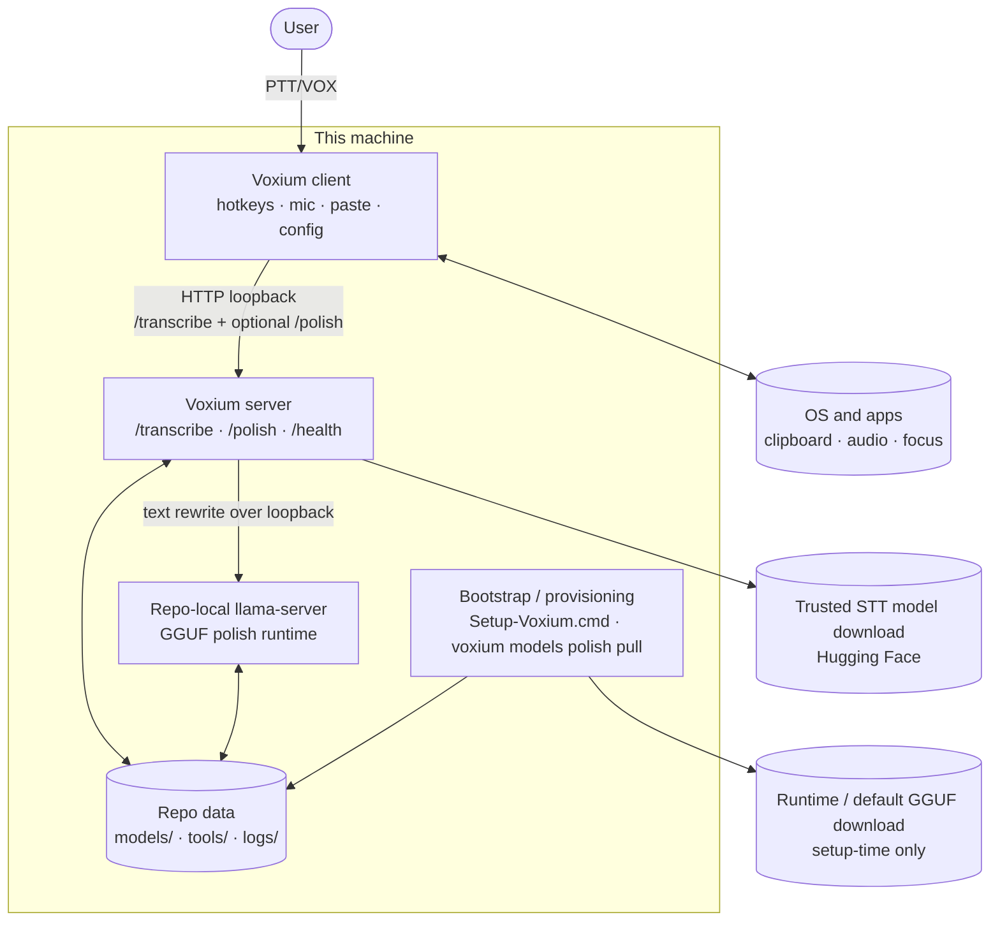
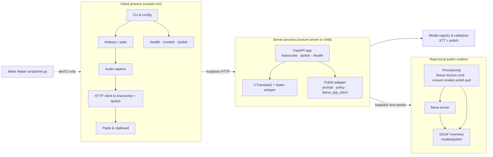
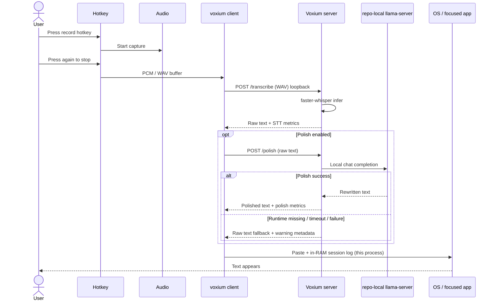
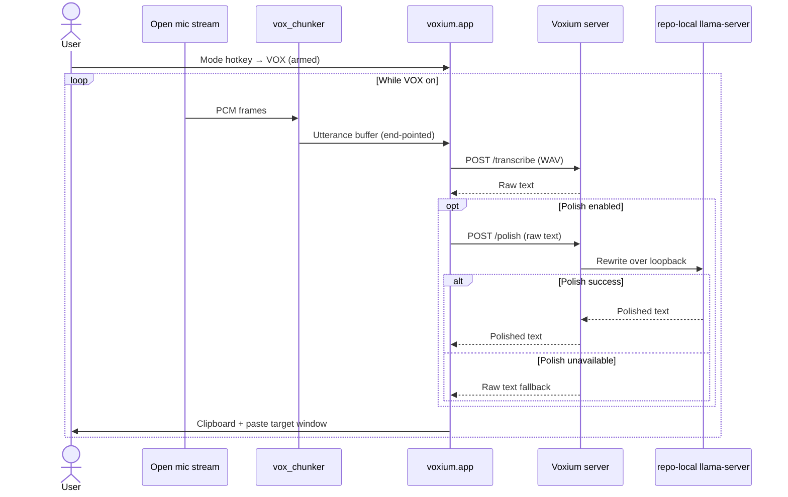
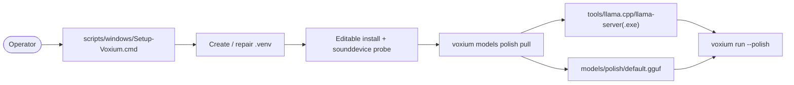
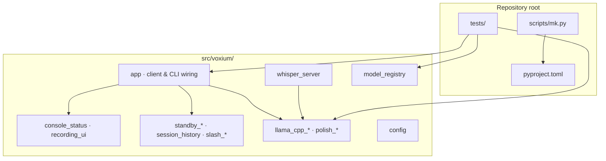
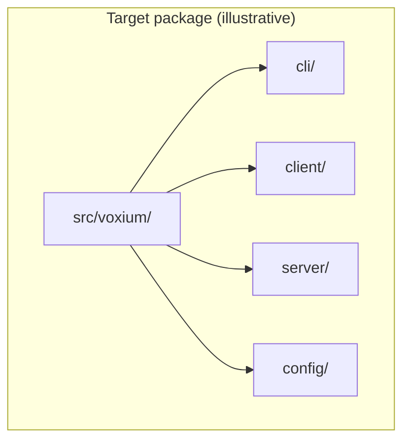

# Voxium architecture

This document describes how **Voxium 0.0.2** is structured: who uses it, which **stack** parts exist, how a **PTT** (push-to-talk) **VOX** flow becomes text, how the optional **polish** pass is inserted, and how the **repository** maps to that path. The tone in diagram labels follows [brand.md](brand.md) — *radio* clarity plus the **new-space-race** “first local integration” of people, **hardware** (mic, GPU/CPU), **software** (client, model), and **automated coding-agent** work (inference, agents) on the loop. Written for **maintainers and contributors** (see [testing](testing.md) for tests and coverage).

---

## 1. System context

Voxium is **local-first** **PTT** voice: the user runs a **client**; when possible a **local HTTP** worker (faster-whisper / CTranslate2) on the same machine does **`/transcribe`** and, when enabled, **`/polish`** only on **loopback**. The optional polish path uses a repo-local **`llama-server`** runtime with **GGUF** models under the repository tree. Windows bootstrap and `voxium models polish pull` provision that local runtime/model bundle.

*(Standard Mermaid; renders on GitHub and most Mermaid 9+ previewers.)*

**Design constraints (product):**

- Transcription **URL must be loopback** (enforced in the client).
- Polish **URL and runtime** stay **loopback-only**; the app-facing surface is still the Voxium server.
- **Default inference path** is **GPU (CUDA)** where available; **CPU** is a supported mode via CLI / config.
- **Privacy:** raw audio and text stay on the machine; external network use is limited to **initial model/runtime provisioning** (trusted STT downloads plus the default polish runtime/model bundle).

---

## 2. Logical components

The product code lives in **`src/voxium/`** (installed as the `voxium` package). The diagram below is **logical**—it shows responsibilities; module names in the table are the on-disk / import paths to use in docs and tests.

| Logical area | Current modules (indicative) | Role |
|--------------|--------------------------------|------|
| **CLI & run loop** | `voxium.app` (argparse, `run`, hotkeys) · entry: `voxium` / `python -m voxium` | User entry, spawns or reuses local server. |
| **Session UI** | `voxium.console_status`, `voxium.recording_ui` | Green **Voxium** panel (Rich), on-station line, live PTT / **VOX** HUD + waveform strip; fresh panel per on-station or VOX listen cycle. |
| **Focus & PTT logic** | `voxium.terminal_focus`, `voxium.ptt_keying` | Best-effort terminal focus for `/` when `slash_global` is off; tap-to-toggle and hold-to-talk semantics for the record key (pure, testable). |
| **VOX chunking** | `voxium.vox_chunker` | RMS / hangover utterance segmentation for open-mic mode (testable pure logic). |
| **Standby & path** | `voxium.standby_fft`, `voxium.standby_telemetry` | rFFT strip of last good take (animated, display-only), standby detail line. |
| **In-RAM transcripts** | `voxium.session_history` | Bounded PTT/VOX text list for this process; **`/history`** — not persisted under a repo `history/` directory. |
| **Slash & disk readouts** | `voxium.slash_commands`, `voxium.slash_complete`, `voxium.disk_usage_report` | ` /` downlink commands, tab completion, `/health`, `/models`, `/polish`, and `make disk-usage` / `/disk` for `models/`, `logs/`, and `tools/llama.cpp/`. |
| **Local server** | `voxium.whisper_server` | FastAPI, `/transcribe`, `/polish`, `/health`, STT load, polish routing, metrics. |
| **Local polish runtime** | `voxium.llama_cpp_daemon`, `voxium.llama_cpp_client`, `voxium.polish_prompt`, `voxium.polish_policy`, `voxium.polish_model_registry` | Repo-local `llama-server` lifecycle, GGUF inventory, prompt/policy, and loopback polish HTTP calls. |
| **Provisioning** | `voxium.polish_provision`, `scripts/windows/Setup-Voxium.ps1` | Repo-local runtime/model provisioning for the default polish path; Windows setup owns the full bootstrap. |
| **Trusted models** | `voxium.model_registry` | Allow-list and repo resolution for Systran STT models. |
| **Config** | `voxium.config` (`VoxiumUserConfig`) | YAML at `~/.config/voxium/config.yaml` validated on load. |
| **Build / dev** | `Makefile` (Linux / GNU make), `scripts/mk.py` | `.venv`, install, test, coverage; on Windows use `voxium` and `python -m` (see README). |

---

## 3. Sequence: record → transcribe → paste

Simplified **happy path** for one utterance (actual threading and state live in `voxium.app`). The app-facing API surface is still the Voxium server; the optional polish pass is a second local hop only after STT succeeds.

**Transcripts** for **`/history`**, F8 replay, and related flows live **only in RAM for the client process** (bounded by config). The product does **not** write a transcript log to a `history/` folder under the repository.

**Errors** (500 from server, missing CUDA DLLs, missing `llama-server`, missing GGUF model, etc.) are surfaced in the **client UI** and in **`voxium_server.log`**; polish failures fall back to raw STT text so paste continues when transcription already succeeded.

### 3.1 VOX (open mic) path

**VOX** mode keeps a **continuous** capture stream (separate from PTT’s key-gated stream). Audio is fed to **`voxium.vox_chunker.UtteranceChunker`**, which emits mono utterance buffers when RMS-based end-pointing fires (hangover silence; threshold hysteresis so there is no dead band between “speech” and “silence”). Each chunk can be gated with **`speech_guards.has_speech`** before HTTP **POST** to **`/transcribe`**, same as PTT. The green **Voxium** panel treats **VOX re-arm** (listen again after copy) like **on station**: a **new** one-step `Live` block so scrollback stays one readable block per cycle—see `voxium.console_status` (`vox_open_listening_starts_fresh_panel`, `standing_by_ready_starts_new_panel`). Mode changes are echoed in the **violet downlink**, not merged into the green session steps.

### 3.2 Bootstrap and local polish provisioning

The shipped Windows bootstrap owns the full local polish setup: create the venv, install Voxium, verify the mic stack, then provision the repo-local `llama.cpp` runtime and default GGUF model. Repeat runs are idempotent: if the runtime/model already exist, the provisioning step reuses them and does not force a fresh download.

**Platform note:** Windows setup provisions both runtime and default model. On other platforms, the same `voxium models polish pull` command provisions the default GGUF model, but the operator still needs a local `llama-server` binary under `tools/llama.cpp` (or on `PATH`) today.

**Warm residency:** startup preflights the selected STT model through `/ensure-model`, including a tiny first-inference warmup, so the first real PTT does not pay model-load or lazy decoder setup. The shared polish / UX `llama-server` path also warms by default and uses `--polish-keep-alive -1` / `--sleep-idle-seconds -1` unless the operator configures an unload window.

---

## 4. Repository layout

**Layout:** a **`src/voxium/`** installable package, console script `voxium` → `voxium.cli.main:main`, and `python -m voxium` for the same entry. Tests and tooling stay at the repo root.

**Further evolution (optional):** split `voxium.app` into explicit **`client/`**, **`server/`**, and richer **`config/`** subpackages. Prefer **incremental** refactors **driven by tests** (see [testing.md](testing.md)).

---

## 5. Configuration

Effective configuration is merged from (conceptually, in order of override):

1. **Defaults** in `voxium.app` and server defaults in `voxium.whisper_server`
2. **`~/.config/voxium/config.yaml`** (or Windows equivalent) when present — loaded and merged via **`VoxiumUserConfig`** in `voxium.config`
3. **CLI flags** and **environment** (e.g. `WHISPER_MODEL`, `WHISPER_DEVICE`)

Polish-specific config lives in the same flow:

- `transcription.polish_enabled`
- `transcription.polish_model`
- `server.llama_cpp_url`
- `server.llama_cpp_auto_start`
- `server.llama_cpp_cmd`
- `server.llama_cpp_gpu_layers`
- `server.llama_cpp_ctx_size`
- `server.polish_keep_alive`
- `server.polish_warmup_on_start`

---

## 6. Related reading

- [testing.md](testing.md) — coverage **fail-under** gate (see `pyproject.toml`), `make test-cov`, markers.
- Top-level [README.md](../README.md) — user-facing install and run.
