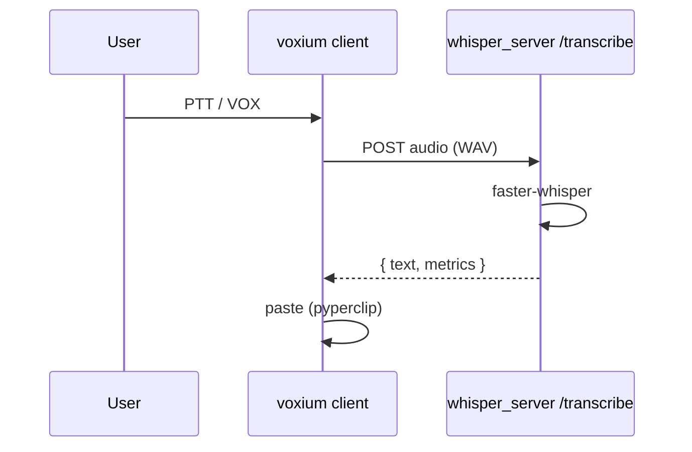
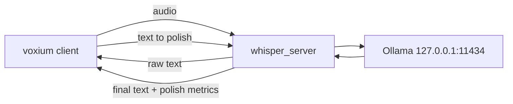
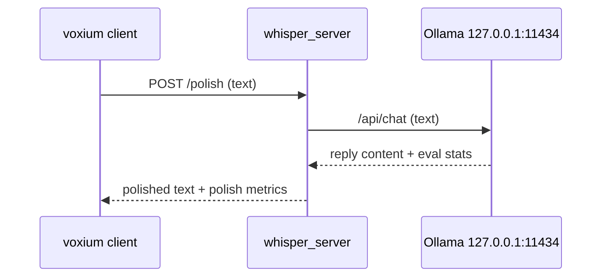

# LLM “polish” layer after transcription — implementation plan

**Status:** implementation reference for the local polish path; keep this doc aligned with the shipped code and remaining hardening work.  
**Audience:** operators and contributors who will wire **local** speech-to-text (STT) to an optional **local** text post-processor for clearer English.

> Current runtime note: the shipped polish path now uses a repo-local **`llama.cpp`** runtime (`llama-server`) plus **GGUF** models under `models/polish`. On Windows, **`scripts\windows\Setup-Voxium.cmd`** and **`voxium models polish pull`** provision the repo-local runtime under `tools/llama.cpp` and the default GGUF model under `models/polish`. Older references to **Ollama** in this draft are historical and should be treated as migration notes, not the active runtime contract.

**Brand note (for future user-facing copy):** Frame this as a **second pass on the local stack** — *humans* key the mic, **robot** work does STT then a short *local* rewrite, still on **your** machine (see [brand.md](brand.md)). Avoid promising “perfect” English; prefer “smoother copy / clearer line” in UI and logs.

---

## 1. Goals and non-goals

### 1.1 Goals

- After **faster-whisper** returns raw transcript text, optionally run that text through a **local** LLM to:
  - smooth grammar and punctuation,
  - keep **meaning** and **no new facts** (policy enforced mainly by **prompting**, with tests and guardrails),
  - output **one** string suitable for the same **paste** path the app uses today.
- **Reuse the same loopback HTTP process** the operator already runs (`voxium server` / `whisper_server.py`) with a **separate `/polish` endpoint** for text rewrite work, so STT and polish can be scaled and controlled independently while staying local (see [§3](#3-architecture-options)).
- Expose the feature in **config**, **CLI**, and **in-session controls** with a unified `/models` surface for STT + polish model selection, plus explicit polish enable/disable controls.
- Show **inference-style metrics** in the same spirit as current `/transcribe` (`metrics` JSON, GPU where available) and a **downlink / “boxy” log** line in the TUI when polish runs.

### 1.2 Non-goals (initial ship)

- **Cloud** LLM APIs (OpenAI, Gemini API, etc.) — out of product path unless you explicitly add them later.
- **Full document editing** or multi-turn chat with the user inside Voxium’s green panel; this is a **one-shot rewrite** of the last transcript line unless you extend scope.
- **Guaranteed** factual correctness; the user must treat output as **assistant text** and keep human review for sensitive or compliance-heavy content.

### 1.3 Name disambiguation (you asked for Gemma / “Quinn” / Ollama)

| You wrote | Likely meaning |
|-----------|----------------|
| **Gemma** | Google’s **Gemma** open models, often run via Ollama tags such as `gemma2`, `gemma2:2b`, `gemma2:9b` (names change with Ollama’s library). |
| **Quinn** | Often a typo for **Qwen** (Alibaba), e.g. `qwen2.5`, `qwen2.5:7b` in Ollama. |
| **Q, W, E** | May mean **quantization** tags (Q4_K_M, etc.) in GGUF/ollama, or unrelated keyboard shortcuts; confirm in product copy once you pick a **single** default model list. |
| **Olamma** | **Ollama** — local model runner with HTTP API on loopback, typically `http://127.0.0.1:11434`. |

This plan **does not** hard-code Gemma only; it treats **Ollama model tags** (or a future in-process backend) as **pluggable** strings, similar to `TRUSTED_MODELS` for STT.

### 1.4 v1 polish model allow-list (initial)

Use these tags first (small/fast local polish set):

- `qwen3.5:4b` (default)
- `qwen3.5:2b`
- `qwen3.5:0.8b`
- `ministral-3:3b`
- `gemma4:e2b`

Store pulled Ollama artifacts under repo `models/ollama` (via `OLLAMA_MODELS`) so `/disk` and `make disk-usage` remain accurate without extra tooling.

---

## 2. Current pipeline (as implemented today)

Relevant code paths (for implementers):

- **Server:** `src/voxium/whisper_server.py` — `POST /transcribe` returns JSON with `text`, `segments`, `metrics` (STT + GPU, etc.).
- **Client:** `transcribe_server()` in `src/voxium/app.py` — `requests.post(config.server_url, files=…, data=…)` to that URL, then `result["text"]` → paste.
- **Session STT model:** `slash_commands` `/models` + `voxium models` + `config.model` on the client; server validates with `voxium.model_registry.validate_model_name`.

**Implementation reality that matters for polish work:**

- Slash commands are implemented in `src/voxium/slash_commands.py`, but **slash completion/hints are separate** in `src/voxium/slash_complete.py`.
- Hotkey normalization/collision policy is centralized in `src/voxium/hotkey_rules.py` and `DEFAULT_HOTKEYS` in `src/voxium/constants.py`.
- Auto-started local server args are built in `src/voxium/local_server_cmd.py`; new server-side polish flags must be wired there.
- `config.timeout` on the server currently appears in `/health` but is not enforcing request cancellation in `/transcribe`; if you depend on timeout guarantees for polish, make timeout behavior explicit in code.

**Implication:** “Polish” is a **new stage** in the same logical “take”; it must not break the **loopback-only** security story (`voxium.loopback`) or existing PTT/VOX/session-history behavior.



---

## 3. Architecture options

### 3.1 Option A — **Dedicated `/polish` endpoint in `whisper_server` (recommended)**

Keep `/transcribe` STT-only. Add `POST /polish` for text rewrite work. Client flow becomes:
`POST /transcribe` -> raw text -> (optional) `POST /polish` -> paste.

- **Ollama as backend:** `whisper_server` uses `requests` (already runtime dependency) to `POST http://127.0.0.1:11434/api/chat` (or `/api/generate`) with a **strict system prompt** and transcript text as input.
- **Pros:** clean separation of concerns, per-endpoint timeout/concurrency controls, easier horizontal scaling decisions later, and no STT contract churn.
- **Cons:** two local HTTP calls per polished take; client must orchestrate fallback logic across both calls.

### 3.2 Option B — **Chain polish inside `/transcribe`**

One server call per take (`POST /transcribe`) with optional polish fields in that same request.

- **Pros:** single round-trip and slightly simpler client path.
- **Cons:** couples STT and polish scaling/failure domains; increases `/transcribe` surface and makes endpoint-level resource tuning harder.

### 3.3 Option C — **Client calls Ollama directly after `/transcribe`**

Client: `POST /transcribe` -> `text` -> if polish enabled, client calls Ollama on `11434`, then paste.

- **Pros:** `whisper_server` stays STT-only.
- **Cons:** duplicated loopback/validation logic in client, two config surfaces, and less centralized observability/health reporting.

### 3.4 Option D — **In-process LLM (no Ollama)**

Embed **llama.cpp** / **ctransformers** / **vLLM**-style in Python — large dependency surface, GPU memory management duplicates Ollama.

- **Verdict for v1:** prefer **A** first; keep **B/C** as alternatives and **D** as later optimization.

**Recommendation:** **Option A**. Keep `/transcribe` stable and STT-focused, add `/polish` as an independent local endpoint, and run Ollama behind server-side loopback validation.



---

## 4. HTTP API shape

### 4.1 Keep `POST /transcribe` STT-only (no polish fields)

No polish controls are added to `/transcribe` in v1. Existing request/response contract stays stable.

### 4.2 Add `POST /polish` (primary interface for rewrite)

`application/json` request:

```jsonc
{
  "text": "… raw STT text …",
  "model": "qwen3.5:4b",    // optional override
  "backend": "ollama",      // optional, v1 supports ollama only
  "keep_alive": "-1"        // optional passthrough hint (duration, seconds, -1, or 0)
}
```

Response:

```jsonc
{
  "text": "… final text for paste …",
  "text_raw": "… original input text …",
  "polish": {
    "enabled": true,
    "attempted": true,
    "applied": true,
    "model": "qwen3.5:4b",
    "backend": "ollama",
    "seconds": 0.42,
    "tokens_in": 120,
    "tokens_out": 85,
    "error": null
  },
  "metrics": {
    "polish": {
      "model": "qwen3.5:4b",
      "backend": "ollama",
      /* timing/tokens/etc */
    }
  }
}
```

**Behavior policy (normative):**

- Empty/missing `text`, unknown backend, or malformed model/backend input -> `400`.
- Polish success -> `text` is polished output, `text_raw` echoes input.
- Backend timeout/failure after valid request -> return `200` with `text=text_raw=input`, `polish.applied=false`, and `polish.error` populated.
- If `/polish` is unreachable from client, client falls back to raw STT output and still pastes.
- If polish is enabled/attempted, transcribed text item metrics must include `metrics.polish.model` (and backend) so operators can audit which model produced the rewrite.

This keeps PTT/VOX dictation resilient while separating STT and polish endpoint concerns.

### 4.3 Health and discovery

Extend **`GET /health`** with:

- `polish_backend_default: "ollama" | null`,
- `polish_enabled_default: bool`,
- `polish_default_model: str | null`,
- `polish_timeout_seconds: number | null`,
- `polish_keep_alive_default: str | number | null`,
- `polish_ollama_reachable: bool`,
- `polish_ollama_reachable_reason: str | null`,
- `polish_model_loaded: bool | null` (best-effort from Ollama `/api/ps`; `null` if unknown).

Do not include secrets.

---

## 5. Ollama integration details (default backend)

- **Base URL** configurable: default `http://127.0.0.1:11434` (env `VOXIUM_OLLAMA_URL` or config).
- **Loopback policy:** enforce loopback-only host for Ollama URL using `voxium.loopback.is_loopback_url` (or equivalent URL-host check).
- **API:** `POST /api/chat` with `model`, `messages: [{role, content}]`, `stream: false`, `options` with low creativity and output cap.
- **System prompt (central artifact):** short, testable rules, e.g. *“You fix grammar and disfluency only. Do not add facts. Do not answer questions. Output one paragraph.”* Store in a dedicated module and version it.
- **Timeout:** separate polish timeout (recommended 15–30s default) from STT runtime.
- **Model residency / warm path:** support `keep_alive` policy for low-latency follow-up requests. Default to `-1` in v1 so the active GGUF stays resident unless the operator configures an unload window, and allow per-request override from `/polish`.
- **Warmup:** startup no-op/chat warmup call is on by default when polish is enabled so first dictation does not pay full cold-start cost.
- **Parsing:** normalize both success and non-success Ollama responses into one internal result object so callers never parse raw response JSON directly.



---

## 6. Client, CLI, and in-session configuration

### 6.1 Config file (`~/.config/voxium/config.yaml`)

Keep existing section layout and add keys in the sections already used by parser defaults:

```yaml
transcription:
  polish_enabled: false
  polish_model: "qwen3.5:4b"
  polish_backend: "ollama"

server:
  ollama_url: "http://127.0.0.1:11434"
  polish_timeout: 20
  polish_keep_alive: "-1"
  polish_warmup_on_start: true

hotkeys:
  # optional v2: only if hotkey toggle ships
  # polish: f5
```

Keep unknown keys allowed (current Pydantic `extra="allow"` behavior).

### 6.2 CLI (`voxium run` / `voxium server`)

- Client (`voxium run`):
  - `--polish` / `--no-polish`
  - `--polish-model MODEL`
  - `--polish-backend ollama`
- Server (`voxium server`):
  - `--ollama-url URL`
  - `--polish-timeout SECONDS`
  - `--polish-keep-alive DURATION|SECONDS|-1|0`
  - `--polish-warmup-on-start` / `--no-polish-warmup-on-start`
  - `--polish-default-model MODEL`

**Repo-local llama.cpp provisioning note:** the active polish path keeps its runtime and model inventory under the repository tree:

- `tools/llama.cpp/llama-server(.exe)` for the runtime,
- `models/polish/*.gguf` for local polish models, and
- `voxium models polish pull` for provisioning the default runtime/model bundle.

Wire run defaults from config in `add_run_options`, server defaults in `add_server_options`.

### 6.3 Session toggles (hotkey and/or slash)

- **Unified model command (`/models`)**:
  - `/models` shows both model lanes and state in one place:
    - transcription model (STT),
    - polish enabled (`on|off`),
    - polish model tag.
  - `/models transcribe <name>` sets STT model (existing behavior, documented explicitly).
  - `/models polish <tag>` sets polish model tag.
  - `/models polish on|off` enables/disables polish step for the current session.
- **Focused alias (`/polish`)**:
  - `/polish` (status)
  - `/polish on|off` (toggle, equivalent to `/models polish on|off`)
  - `/polish model <tag>` (equivalent to `/models polish <tag>`)
- **CLI and config parity for enable/disable**:
  - `--polish` / `--no-polish` on `voxium run`,
  - `transcription.polish_enabled` in config,
  - slash toggles update runtime state (and can be persisted later if/when config writeback exists).
- **Slash completion/hints:** update `slash_complete.py` (`SLASH_COMMAND_ORDER`, aliases, and completion branches for `/models polish ...` and `/polish ...`).
- **Hotkey (optional v2):** if added, update `DEFAULT_HOTKEYS`, `hotkey_rules` canonicalization/sanitization loops, and tests.

### 6.3.1 `/models` output contract (v1 mock)

Use one stable operator-facing layout so tests and docs agree. Exact typography can vary, but these fields and values must be present.

Example: `/models` with polish enabled

```text
Models
  Transcribe: medium.en
  Polish: on
  Polish model: qwen3.5:4b
  Polish backend: ollama
```

Example: `/models` with polish disabled

```text
Models
  Transcribe: medium.en
  Polish: off
  Polish model: qwen3.5:4b
  Polish backend: ollama
```

Example: set STT model

```text
/models transcribe small.en
Transcribe model set: small.en
```

Example: set polish model

```text
/models polish qwen3.5:4b
Polish model set: qwen3.5:4b
```

Example: enable/disable polish

```text
/models polish on
Polish: on

/models polish off
Polish: off
```

Example: validation errors

```text
Unknown transcribe model: foo
Try: /models
```

```text
Unknown polish backend/model tag: bar
Try: /models polish <tag>
```

Contract rules:
- `/models` is the canonical status view for both STT and polish.
- `/polish` remains a convenience alias and must reflect the same runtime state.
- Changes through `/polish` must be immediately visible in `/models`.
- If polish is disabled, `/models` still shows the selected polish model tag.

### 6.4 TUI / “boxy” log and metrics

- Keep green panel flow unchanged (avoid duplicate status-box regressions).
- Add one violet downlink line on polish completion/fallback, e.g. `Polish: on · qwen3.5:4b · 0.42s · fallback=no`.
- Extend transcript metrics rendering to include polish model/backend and timing/tokens when present.

---

## 7. Timeout and failure behavior (must be explicit)

Define this before coding:

- **HTTP client timeouts (`app.py`)** should be explicit per endpoint: one for `/transcribe`, one for `/polish` (or one composed timeout policy with separate caps).
- **Server-side timeout semantics** must be real, not metadata-only:
  - STT timeout behavior documented and enforced on `/transcribe`,
  - polish timeout enforced independently on `/polish`,
  - on polish backend timeout, `/polish` returns `200` fallback payload per §4.
- **Warm-memory policy** must be explicit:
  - default `keep_alive` value documented and exposed via config/health,
  - `/polish` may override keep-alive per request,
  - emergency memory release path documented (`keep_alive=0`).
- **Clipboard/paste path** must remain unchanged: polish errors never block paste when STT succeeded.

### 7.1 Throughput and backpressure

- Add bounded in-process concurrency for `/polish` (for example semaphore/worker cap) to avoid tail-latency collapse when multiple takes arrive quickly.
- Return explicit backpressure response when saturated (`429` or `503` with retry hint), while preserving client raw fallback behavior.
- Keep `/transcribe` and `/polish` queueing independent so polish load does not block STT request admission.

---

## 8. GPU, VRAM, and performance

- **STT (CTranslate2/CUDA)** and **Ollama (often CUDA or Metal)** may **compete** for one GPU. Mitigations:
  - **Serial execution only:** run LLM **after** STT completes (no parallel GPU contention within one request).
  - **Environment hints:** document `CUDA_VISIBLE_DEVICES`, Ollama per-model GPU settings, optional force-CPU for polish model.
  - **Model sizes:** default to **small** local models (e.g. 2B–4B) for “polish” to keep latency down.
- **Load testing:** measure **end-to-end** PTT-to-paste with polish on for 30/60/120s audio equivalents (short phrases matter most for dictation).

---

## 9. Safety, privacy, and abuse

- **Loopback only** for both Voxium server and Ollama URL in reference config and code validation.
- **Prompt injection:** user speech could contain *“ignore instructions”*; mitigate with strict system prompt and output constraints.
- **Data retention:** do not log raw audio or full transcript text by default in new code paths.
- **Log discipline:** include request ids, model/backend, timings, and error class; avoid logging full content except DEBUG.

---

## 10. Testing strategy

### 10.1 Unit tests (required)

- `tests/test_slash_commands.py`:
  - `/models` status includes STT + polish state,
  - `/models` status output contains the contract fields from §6.3.1,
  - `/models polish <tag>` and `/models polish on|off`,
  - `/polish` alias parity (`on|off` and `model`).
- `tests/test_slash_complete.py`: completion aliases and Tab cycle for both `/models polish ...` and `/polish ...`.
- `tests/test_local_server_cmd.py`: verify new server launch args are included/omitted correctly.
- `tests/test_hotkey_rules.py`: only if a polish hotkey action is added.
- New module tests:
  - `tests/test_ollama_client.py` (request builder, timeout/failure mapping),
  - `tests/test_polish_prompt.py` (prompt text/version invariants),
  - `tests/test_polish_policy.py` (keep-alive defaults/override resolution and warmup flag behavior).

### 10.2 Server contract tests

- Extend `tests/test_server_health.py` for new `/health` fields.
- Add `tests/test_server_polish.py` (or similar):
  - `/transcribe` stays STT-only and does not require polish fields,
  - `/polish` success returns `text` + `text_raw` + `polish.applied=true`,
  - `/polish` success includes `metrics.polish.model` (matching effective polish model),
  - `/polish` timeout/failure falls back to raw with `polish.error`.
  - `/polish` forwards configured/per-request `keep_alive` to backend.
  - `/polish` saturation path returns configured status (`429`/`503`) and client still pastes raw STT text.

### 10.3 Integration tests (optional in CI)

- Mock Ollama HTTP with `respx`/`pytest-httpserver`.
- Keep GPU/real-model cases optional markers, not required in default CI lane.

---

## 11. File-by-file implementation map (v1 Option A: separate `/polish`)

| File | Required change |
|------|-----------------|
| `src/voxium/whisper_server.py` | Keep `/transcribe` STT-only; add `/polish` request handling, invoke polish backend, return normalized polish payload, extend `/health`. |
| `src/voxium/app.py` | Add polish runtime/session state, call `/polish` after successful `/transcribe`, surface downlink status, keep paste fallback behavior. |
| `src/voxium/local_server_cmd.py` | Add server launch args for ollama URL/polish timeout/default model. |
| `src/voxium/config.py` | No schema lock change required (dict sections already open), but document new keys. |
| `src/voxium/constants.py` | Add any new default constants (polish model/backend/url/timeout and optional hotkey). |
| `src/voxium/polish_policy.py` (new) | Resolve keep-alive defaults, per-request overrides, and warmup policy in one place. |
| `src/voxium/hotkey_rules.py` | Only if adding hotkey toggle: include new action in canonicalization/sanitization. |
| `src/voxium/slash_commands.py` | Add `/polish` command family and help text updates. |
| `src/voxium/slash_complete.py` | Add completion order and aliases for polish commands. |
| `src/voxium/loopback.py` | Reuse/add helper for validating Ollama URL loopback host. |
| `src/voxium/ollama_client.py` (new) | Isolated HTTP client + response normalization for Ollama API. |
| `src/voxium/polish_prompt.py` (new) | Versioned system prompt and prompt builder. |
| `tests/*` | Add/extend tests listed in §10. |

---

## 12. Phased delivery (updated)

| Phase | Deliverable |
|-------|-------------|
| **P0** | Add `ollama_client` + prompt module + unit tests; no client UX surface yet. |
| **P1** | Add server `POST /polish` + `/health` polish readiness fields + fallback payload semantics; keep `/transcribe` unchanged. Include keep-alive default and optional warmup. |
| **P2** | Client orchestration (`/transcribe` then optional `/polish`), slash commands/completion, downlink line, metrics display extension. |
| **P3** | Optional hotkey toggle, model listing UX for Ollama tags, hardening/allow-list/retries. |
| **P4** | Optional secondary backend (`llama.cpp`) behind same provider interface for smaller runtime footprint experiments. |

---

## 13. Decisions for v1 (resolved to unblock coding)

These defaults remove ambiguity from implementation; change only with explicit product decision.

1. **History buffer stores final pasted text only** (`text`), not both variants.
2. **`/transcribe` remains STT-only** in v1 (no polish form fields).
3. **Failure policy is raw fallback** when polish fails after STT success (`/polish` fallback payload or client-side fallback if `/polish` is unreachable).
4. **Default polish residency uses keep-alive** (v1 default: `-1`, keep loaded; configurable; per-request override allowed).
5. **Feature name in UX is “Polish”** (`/polish`, `--polish`, downlink label `Polish:`).
6. **No new `voxium doctor` command in v1**; health/readiness is surfaced through `/health` and docs.
7. **Enable/disable controls are first-class** and equivalent across surfaces:
   - slash: `/models polish on|off` (primary) and `/polish on|off` (alias),
   - CLI: `--polish` / `--no-polish`,
   - config: `transcription.polish_enabled`.

---

## 14. Acceptance checklist (ship gate)

A PR implementing this feature is ready only when all are true:

- `make test` passes with new polish tests.
- `make lint` passes with new modules and CLI/slash changes.
- `/transcribe` behavior with polish off is exactly current baseline (STT-only contract unchanged).
- `voxium run --polish` calls `/polish` after STT and, with Ollama reachable, returns polished text and logs polish metrics.
- Polished transcribed text item metrics include effective polish model/backend when polish is enabled/attempted.
- `/polish` timeout/unreachable/backend failure still pastes raw STT text and emits clear warning/downlink.
- Operator can enable/disable polish step at runtime via slash (`/models polish on|off` or `/polish on|off`) and launch-time via CLI/config.
- `/models` presents both STT and polish model state so operators do not need separate discovery paths.
- Keep-alive policy is configurable, observed in `/health`, and warmup-on-start behavior is documented/tested.
- `/health` reports polish readiness fields without exposing sensitive data.
- Loopback-only constraints are enforced for both Voxium and Ollama URLs.

---

## 15. References in repo

- [README.md](../README.md) — Windows + loopback
- [architecture.md](architecture.md) — high-level context
- [testing.md](testing.md) — coverage and pytest patterns
- [brand.md](brand.md) — user-visible/operator-facing voice

This document is the **implementation checklist and operator reference** for the local polish path; tracking issue/PRs should reference this checklist and mark completed phases/items explicitly.
