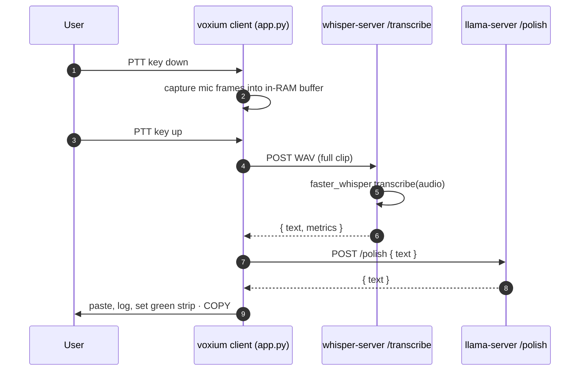

# Live transcribe streaming — implementation plan

**Status:** design draft, rev 2 (post-gap-review). Branch `feat/live-transcribe-stream`. No code shipped yet.
**Audience:** contributors implementing the on-key live readback for the PTT/VOX surface.

> Brand note: this surface is "type-out from the wire while the carrier's still keyed" — words appear in the green PTT/VOX strip as the operator speaks, like a teletype watching the receiver. The polished commit still lands at PTT release / VOX utterance end via the existing batch `/transcribe` → `/polish` → paste chain. Live text is **texture**, never the source of truth that gets pasted. See [docs/brand.md](../brand.md) for voice; framing is on-station coding-agent loop, not literal NASA.

---

## 1. Goals and non-goals

### 1.1 Goals

- Show **live partial transcript** in the green PTT/VOX status strip while the operator is talking — within ~500 ms of speech.
- Apply equivalently to **PTT** (key down → up) and **VOX** (utterance start → silence), since both are bounded-utterance modes.
- Keep the existing **batch `/transcribe` → polish → paste** path *unchanged* and authoritative for what gets pasted.
- Reuse the existing whisper-server process and `faster-whisper`; no new model framework.
- **5-second sliding window** of audio per session, re-decoded on every chunk arrival.
- **Fail-soft**: if the streaming WebSocket dies, drops, or never connects, the operator still gets correct text on release. Live readback going dark is a UX downgrade, never a correctness issue.
- Extend `/profile` with a `transcribe_stream` lane so we can measure live decode cost per take and gate against GPU pressure.

### 1.2 Non-goals (this ship)

- **Streaming-native models** (NVIDIA Parakeet RNN-T, Vosk, Canary). Listed in [§10](#10-out-of-scope-future-work).
- **LocalAgreement-2** or other stable-commit algorithms. The naive sliding window is the v1; we'll measure jitter and add LA-2 only if needed.
- **Polish-on-stream**. Polish stays a one-shot pass over the *final* batch transcript. Live text is never re-encoded.
- **Replacing the existing `/transcribe` endpoint**. Streaming is purely additive.
- **Streaming over the public network**. Loopback-only stays the security model. WebSocket bind address normalizes through `loopback.normalize_loopback_url` and connections are rejected from non-loopback origins (see [§3.2.3](#323-loopback-enforcement)).
- **Multi-session resumption**, persistent transcripts, or any history surface for live partials. Live text is volatile by definition; only the final commit hits `/history`.
- **Non-English live decoding tuning**. `faster-whisper` will still autodetect / honor `--language`; we don't add language-aware streaming heuristics in v1.
- **Mobile / remote operators**. Voxium remains a single-machine PTT app.
- **`whisper.cpp` backend** for streaming. v1 reuses the running `faster-whisper` `WhisperModel` instance loaded by `whisper_server.startup()` (see [§3.2.2](#322-backend)).

### 1.3 Definitions

| Term | Meaning |
|---|---|
| **Chunk** | Fixed-size PCM frame the client sends to the server. **v1: 4000 samples float32 little-endian, mono, 16 kHz = 16 KB / 250 ms.** Matches Voxium's native capture format (no client-side dtype conversion). |
| **Window** | Server-side audio buffer the model re-decodes against. **v1: 5 seconds rolling.** Older audio scrolls off. |
| **Partial** | Text emitted by the streaming wrapper after one re-decode pass. May revise prior partials. Never authoritative. |
| **Final** | The post-PTT-release transcript from the existing batch `/transcribe` → polish → paste chain. Authoritative. |
| **Session** | One PTT key-press cycle or one VOX utterance. Bounded by clear start and clear end events. |

---

## 2. Current pipeline (recap)

Today's path, single take:



**Key files** (do not change without explicit reason):

- `src/voxium/app.py` — `transcribe_and_paste` (the orchestration), `transcribe()`, `transcribe_server()`. Capture loop + paste path.
- `src/voxium/whisper_server.py` — `/transcribe` FastAPI route, `faster-whisper` wrapper, metrics.
- `src/voxium/loopback.py` — URL hardening; **all new streaming URLs flow through this**.
- `src/voxium/vox_chunker.py` — `UtteranceChunker`. Already does live VAD-based utterance segmentation for VOX; the streaming feature taps into the same frame stream.
- `src/voxium/console_status.py` / `recording_ui.py` — green PTT strip rendering. The Rich `Live` panel where live text will appear.
- `src/voxium/polish_profile.py` — runtime profiling buffers; extended for streaming metrics.

**Native capture format** (verified against `app.py:1955` and `app.py:2501`):

```
samplerate=16_000
channels=1
dtype="float32"
```

Streaming reuses this format on the wire (see [§4](#4-wire-protocol)). The `int16` conversion in `transcribe()` is a *serialization step for WAV* only — it doesn't represent the native pipeline.

---

## 3. Architecture

### 3.1 High-level

```mermaid
flowchart LR
  subgraph Client[voxium client]
    Mic[Mic capture<br/>float32 mono 16k]
    Tee{Audio tee}
    Buf[(In-RAM clip buffer)]
    Vox[VOX UtteranceChunker]
    Frames[Chunk dispatcher<br/>queue.put_nowait]
    UI[Green PTT strip · Live]
  end
  subgraph Server[whisper-server]
    WS[/POST WS /transcribe-stream/]
    Win[(5s sliding buffer)]
    SW[Sliding-window decoder<br/>asyncio.to_thread + Lock]
    Batch[/POST /transcribe (existing)/]
  end

  Mic --> Tee
  Tee --> Buf
  Tee --> Vox
  Tee --> Frames
  Frames -- "PCM chunks 250ms" --> WS
  WS --> Win
  Win --> SW
  SW -- "partial JSON" --> UI

  Buf -- "key up: full WAV" --> Batch
  Batch -- "final text" --> Polish[/llama-server /polish/]
  Polish -- "polished text" --> Paste[Paste · log · /history]
```

Two parallel server-bound flows during a take: streaming PCM frames → live partials, and (at end-of-take) the existing batch POST → polish → paste. The streaming flow has *no input* to the paste path. The audio tee on the client distributes each capture frame to three subscribers (in-RAM buffer, VOX chunker, WS dispatcher); each is independent and non-blocking.

### 3.2 Server: WebSocket endpoint

**Location:** new function in `src/voxium/whisper_server.py`, registered as `@app.websocket("/transcribe-stream")`.

**Lifecycle per connection:**

1. Client opens WS. Server checks loopback origin (see [§3.2.3](#323-loopback-enforcement)) and creates a `_StreamSession` (per-connection state: rolling buffer, last partial text, sample counter, start time).
2. Server sends a `session_open` frame with the negotiated chunk size, sample rate, dtype, language hint, and decoder backend tag.
3. Client sends one or more binary `audio_frame` messages: float32 PCM at 16 kHz mono, no per-frame JSON header.
4. Server, on each frame, appends to the rolling buffer (trimmed to 5 s) and runs the decoder via `asyncio.to_thread(...)` (see [§3.2.1](#321-async-and-thread-safety)). Emits a `partial` JSON message with the new text and a monotonic sequence number.
5. Server emits a `keepalive` JSON message every 5 s when no audio arrives, so the client can detect a stuck server. Client may ignore.
6. On client `end` message (or WS close), server runs *one* more decode on the residual buffer, emits a final `partial` with `is_final: true`, then closes.
7. The **batch** `/transcribe` POST happens separately on the client side after PTT release; it is the authoritative source.

#### 3.2.1 Async and thread safety

`@app.websocket(...)` runs in FastAPI's asyncio loop. `model.transcribe(...)` from `faster-whisper` is **synchronous**. Calling it directly inside the WS handler would block the event loop and starve every other request on whisper-server (including the batch `/transcribe` POST that runs in parallel during the same take). Pinned policy:

- Each re-decode call goes through `asyncio.to_thread(decoder.push, frame)`. The default executor is fine; the threadpool size auto-scales with CPU count.
- **A single shared `WhisperModel` instance** is used across streaming and batch. `model.transcribe` is **not safely re-entrant**, so a module-level `threading.Lock` (named `_whisper_model_lock` in `whisper_server.py`) guards every call into the model — both from the streaming path and from the existing `/transcribe` handler.
- Holding the lock during a streaming re-decode (~50–80 ms) briefly blocks any concurrent batch `/transcribe`, but in normal operation those don't overlap (batch fires at PTT release after streaming has stopped). The worst case is two concurrent operators on the same server.

#### 3.2.2 Backend

Streaming uses the same `faster-whisper` `WhisperModel` instance loaded by `whisper_server.startup()`. **No support for `whisper.cpp` STT backend in v1** — adding it would require a separate decoder abstraction that's out of scope.

#### 3.2.3 Loopback enforcement

The `/transcribe` route validates loopback origin via the existing `is_loopback_url` chain. The new WS route does **not** inherit that gate automatically. At connect:

```python
client_host = websocket.client.host if websocket.client else None
if not is_loopback_host(client_host):
    await websocket.close(code=1008)  # Policy violation
    return
```

This must happen before `_StreamSession` is constructed.

#### 3.2.4 Server-side kill switch

A bug in the streaming path that crashes the FastAPI worker would take `/transcribe` down with it. To enable rollback without a code change:

- Server reads `VOXIUM_STREAM_ENDPOINT_ENABLED` (env) and `streaming_endpoint_enabled` (config, default `true`).
- When false, the `@app.websocket("/transcribe-stream")` route is **not registered** at startup (not just refusing connects — fully absent). Existing endpoints are unaffected.
- `/health` reports `streaming_enabled: false` so the client backs off cleanly.

### 3.3 Sliding-window decoder

**Goal:** keep it as small and dumb as possible for v1. A single Python module, reusable for tests.

**New module:** `src/voxium/transcribe_stream.py`

```python
class SlidingWindowDecoder:
    """
    Per-session re-decode of a rolling audio buffer using the existing faster-whisper
    instance from whisper_server.

    v1: re-runs model.transcribe on the entire current window every push(). Emits the
    full-window text. The client decides how to display.
    """
    WINDOW_SECONDS: float = 5.0
    SAMPLE_RATE: int = 16_000

    def __init__(
        self,
        model: WhisperModel,
        model_lock: threading.Lock,
        *,
        language: str | None = None,
        vad_filter: bool = True,
        suppress_hallucinations: bool = True,
    ) -> None: ...

    def push(self, pcm_float32: np.ndarray) -> StreamPartial:
        """Append samples, trim to WINDOW_SECONDS, re-decode, return partial.
        Acquires model_lock for the .transcribe call. Filters hallucinations
        if suppress_hallucinations=True (uses speech_guards.is_hallucination).
        """

    def finalize(self) -> StreamPartial:
        """Last-pass on whatever is in the buffer; emits final stream-side text."""

    def reset(self) -> None: ...
```

**StreamPartial dataclass:**

```python
@dataclass(frozen=True)
class StreamPartial:
    seq: int               # monotonic per-session
    text: str              # full decoded text of the current window
    audio_seconds: float   # length of the buffer this decode operated on
    decode_ms: float       # wall ms for this re-decode
    is_final: bool         # True only when emitted from finalize()
    suppressed: bool       # True if hallucination filter dropped the text
```

**Pinned decode characteristics:**

- Buffer is `np.float32`. Frames from the wire are validated as float32 16 kHz on push and copied into the rolling buffer; window trimmed by sample count, not time.
- `model.transcribe(audio, language=…, beam_size=1, condition_on_previous_text=False, vad_filter=True)` for the streaming path. Beam 1 + no prior conditioning gives ~2× the throughput of the default beam-5 batch settings, with quality cost mostly absorbed by the fact that the final batch pass uses the higher-quality settings anyway.
- **`vad_filter=True`** by default: faster-whisper's built-in Silero VAD filters silence chunks before decode. This dramatically reduces hallucination rate on quiet windows. Operator override: `streaming.vad_filter: false` config key.
- **Hallucination filter** runs on the decoded text via `voxium.speech_guards.is_hallucination(text)`. When triggered, `suppressed=True` is set and the partial is emitted with empty text. Operator override: `streaming.suppress_hallucinations: false`.
- **Language hint**: `session_open.language` is set from `config.language` (the same value the batch path uses). If `None`, faster-whisper auto-detects; the streaming path inherits whatever the model picks first.

**GPU pressure note:** sliding window 5 s × ~250 ms chunk = ~4 re-decodes per second of audio per active session. For a 6 s take, ~24 forward passes. On `small.en` GPU each pass is ~30–80 ms (5 s of audio). Total live decode wall: ~1–2 s of GPU time spread across the take. This is real; we measure it via [§6 metrics](#6-metrics-and-observability) before declaring v1 done.

### 3.4 Client: capture-side WS sender

**New module:** `src/voxium/transcribe_stream_client.py` (keeps `app.py` from growing further).

**Audio tee** — capture frames flow to **three** subscribers, each independent and non-blocking:

1. **In-RAM clip buffer** — the existing list of `np.float32` arrays used by the batch `/transcribe` POST and re-transmit (F6) replay. Unchanged.
2. **`UtteranceChunker`** (VOX only) — VAD-based utterance segmentation. Unchanged.
3. **WS dispatcher** — new. Aggregates frames into 250 ms chunks and pushes onto a bounded `queue.Queue[bytes]`.

The audio callback (`audio_callback` and `vox_audio_callback`) MUST never block. It is a real-time audio thread; any blocking causes mic dropout. Pinned contract:

```python
try:
    ws_queue.put_nowait(frame_bytes)
except queue.Full:
    metrics.frames_dropped += 1   # backpressure: silently drop
```

The sender thread drains `ws_queue` and writes WS frames. Receiver thread reads partials. The Rich `Live` render thread polls a thread-safe `live_text_state` and updates the green strip.

**Threading model summary:**

| Thread | Owner | Lifetime | Responsibility |
|---|---|---|---|
| Audio callback | sounddevice / PortAudio | take open | Push frames to all 3 subscribers via `put_nowait` |
| WS sender | `transcribe_stream_client` | session open | Drain `ws_queue`, write to socket |
| WS receiver | `transcribe_stream_client` | session open | Read partials, update `live_text_state` |
| Live render | Rich `Live` | always | Poll `live_text_state`, redraw green strip |

**WebSocket library**: `websocket-client` (sync, thread-friendly, ~250 KB install). **Add to `pyproject.toml`** as a regular dependency:

```toml
"websocket-client>=1.7.0",
```

Why not `websockets` (asyncio)? Voxium's main loop is threaded, not async. Adding asyncio would mean either running an event loop in a thread (awkward) or rewriting the capture path. `websocket-client` matches the existing threading idiom.

**Failure modes** (each yields zero impact on paste correctness):

| Mode | Behavior |
|---|---|
| WS connect fails | Live strip stays empty (no `[LIVE]` chip rendered). Capture + batch POST proceed. Log at debug. |
| WS drops mid-take | Live strip freezes at last partial; clears at end-of-take. `[LIVE]` chip switches to dim `[~]` "no carrier". |
| Server emits malformed JSON | Drop the message, continue. |
| Server too slow → backpressure | Sender drops frames after queue depth >8 (= 2 s of buffered audio). Operator sees stale live text but final paste is unaffected. |
| Excessive lag mid-session | Auto-fallback ([§3.5.4](#354-auto-fallback-on-excessive-lag)) closes WS and surfaces a Downlink note. |

**Lifecycle for ungraceful shutdowns** (all yield clean WS close, no leaks):

| Event | Client behavior |
|---|---|
| Operator hits Ctrl+C | `run_client` shutdown signal reaches the WS sender thread via the existing shutdown event; sender sends `{"type":"close"}` and closes the socket within 200 ms. |
| Mic device disconnect mid-take | sounddevice raises in the callback; capture stops; WS sender drains queue, sends `{"type":"end"}`, closes. Same path as a normal end-of-take. |
| Managed-server restart mid-stream | WS dies (server gone). Receiver thread sees closed socket; render thread switches to dim `[~]` "no carrier". Take completes via the existing batch path once the server is back. |
| Mode switch (F7, PTT↔VOX) mid-take | The current take ends; WS closes normally; mode switch proceeds. |
| Mid-session model swap (`/models transcribe use X`) | The slash command checks for an open WS; if found, it finalizes the current take (including the live decode) before swapping the model. |
| Re-transmit hotkey (F6) | Streaming **does not** open during F6 — F6 replays a stored clip via the batch `/transcribe` POST only. There is no fresh audio to stream. |
| Managed-server startup window (before `/health` OK) | Client gates WS open on the existing `_check_server_health` state. If the server isn't ready when PTT fires, the take captures normally and live text is silently skipped for that take. |
| `config.minimal` or `--quiet` | Streaming compute and WS connection are both **skipped entirely** — no UI consumer means no point spending GPU. The `streaming.enabled` flag is honored but overridden by the no-UI mode. |

### 3.5 UI: live transcript rendering

**Where:** the green PTT/VOX status strip (`console_status.PttSessionStatusBox`). Today it shows status + chatter copy/standby line. Add a third line: **live readback**.

#### 3.5.1 Render rules

- **Live indicator chip** (left of text): `▸ wire` in dim style when streaming is active and receiving partials. Dim italic `[no carrier]` when streaming is enabled but WS is closed/failed. No chip at all when streaming is disabled.
- **Live text style**: dim italic for v1's naive sliding window (entire line is "in-flight"). v2 may upgrade to two-tier rendering (committed + tail) when LocalAgreement-2 lands.
- **Truncate** to terminal width minus 8 (room for the chip). Right-side ellipsis if longer.
- **Clear** the live line immediately at PTT key-up / VOX end — operator should not see "live shows partial X, then blue panel shows different polished Y" race for more than a frame. A ~150 ms "Decoding…" beat smooths the handoff.
- **Silence dim**: if VAD reports no voice for >500 ms inside a take, fade the live line further.
- The existing **edge_inference** chatter line is **suppressed when streaming is on** (`streaming.suppress_edge_chatter: true` default). Its job (filler while STT decodes) is replaced by the actual STT decoding being visible.

#### 3.5.2 Worked UX example

What the operator sees during a 6 s PTT take with streaming enabled:

```
# t=0 (PTT key down)
┌─ Voxium · PTT ─────────────────────────────────────────────────────┐
│  ⬤ MIC HOT · ON STATION                                            │
│  ▸ wire                                                            │
└────────────────────────────────────────────────────────────────────┘

# t=1.5s (operator says "remember to check the build")
┌─ Voxium · PTT ─────────────────────────────────────────────────────┐
│  ⬤ MIC HOT · ON STATION                                            │
│  ▸ wire  remember to check the build                              │
└────────────────────────────────────────────────────────────────────┘

# t=4.0s ("...before pushing")
┌─ Voxium · PTT ─────────────────────────────────────────────────────┐
│  ⬤ MIC HOT · ON STATION                                            │
│  ▸ wire  remember to check the build before pushing               │
└────────────────────────────────────────────────────────────────────┘

# t=6.0s (PTT key up; live clears, "Decoding…" beat)
┌─ Voxium · PTT ─────────────────────────────────────────────────────┐
│  ◉ Decoding…                                                       │
│                                                                    │
└────────────────────────────────────────────────────────────────────┘

# t=6.3s (paste; blue panel shows polished text)
┌─ Voxium · PTT ─────────────────────────────────────────────────────┐
│  ◯ STANDBY · COPY                                                  │
│  Remember to check the build before pushing.    ← polished, pasted│
└────────────────────────────────────────────────────────────────────┘
```

The dim `▸ wire` chip + italic body are the visible signal that streaming is engaged. If WS fails mid-take:

```
┌─ Voxium · PTT ─────────────────────────────────────────────────────┐
│  ⬤ MIC HOT · ON STATION                                            │
│  [no carrier]  remember to check the build                        │
└────────────────────────────────────────────────────────────────────┘
```

The text doesn't update beyond the last partial; the chip change tells the operator the live channel is gone but capture is still going.

#### 3.5.3 Multi-utterance VOX render

VOX produces multiple utterances per session. Each utterance opens its own WS:

- Live text **replaces in place** between utterances (no blink, no clear-then-fill flash).
- Between utterances the chip dims to `▸ standby` to signal "waiting for next speech".
- Polished text from each utterance flows to the blue transcription panel as today.

#### 3.5.4 Auto-fallback on excessive lag

If a session shows the streaming subsystem can't keep up:

- **Trigger**: drops > 4 frames in a session, OR `avg decode_ms > 1.5 × chunk_ms`.
- **Action**: close the WS, suppress the live indicator, surface one Downlink note: `Streaming: GPU saturated, falling back to batch for this session, copy.`
- **Scope**: rest of the *current* session. Next session re-attempts.
- **Reset**: after 60 s of clean operation, fallback flag clears.

This prevents the "live looks broken, why is it on?" UX while keeping streaming opt-in for the next take.

---

## 4. Wire protocol

All control frames are JSON text. Audio frames are binary.

### 4.1 Server → client messages

**`session_open`** (first message after connect):

```json
{
  "type": "session_open",
  "version": 1,
  "sample_rate": 16000,
  "channels": 1,
  "dtype": "float32",
  "byte_order": "little",
  "window_seconds": 5.0,
  "max_chunk_ms": 1000,
  "language": "en",
  "model": "small.en",
  "vad_filter": true,
  "hallucination_filter": true
}
```

**`partial`** (after each successful re-decode):

```json
{
  "type": "partial",
  "seq": 7,
  "text": "the local stack on loopback is decoding",
  "audio_seconds": 4.75,
  "decode_ms": 62.3,
  "is_final": false,
  "suppressed": false
}
```

**`keepalive`** (every 5 s when no audio arrives):

```json
{ "type": "keepalive", "session_seconds": 12.4 }
```

**`stream_end`** (terminal partial after client `end` message; just a `partial` with `is_final: true`):

```json
{
  "type": "partial",
  "seq": 12,
  "text": "the local stack on loopback is decoding the clip",
  "audio_seconds": 5.10,
  "decode_ms": 70.1,
  "is_final": true,
  "suppressed": false
}
```

**`error`**:

```json
{
  "type": "error",
  "code": "decode_failed",
  "message": "faster-whisper raised RuntimeError: …"
}
```

Server closes the WS after `error` or `is_final`.

### 4.2 Client → server messages

**Audio frames:** raw binary, **PCM float32 little-endian, 16 kHz mono**. No per-frame JSON header; the channel is established at connect. Server validates the byte length is a multiple of 4 (float32) and rejects malformed frames with `error code=invalid_frame`.

**`end`** (text frame to signal flush + finalize):

```json
{ "type": "end" }
```

**`close`** (text frame for unclean client shutdown — Ctrl+C, mic disconnect):

```json
{ "type": "close", "reason": "client_shutdown" }
```

### 4.3 Versioning and forward compat

`session_open.version: 1` is the only version v1 understands. Both ends validate; mismatch → server emits `error` and closes. Future protocol changes bump the version and gate behavior.

### 4.4 Timeouts

| Phase | Default | Notes |
|---|---|---|
| WS connect | 2.0 s | Client `websocket.create_connection(timeout=2.0)`. |
| Idle (no audio + no client message) | 60 s | Server closes the session if no frame arrives in 60 s. Detected via `keepalive` timing. |
| Close handshake | 2.0 s | Either side: send close, wait up to 2 s for ack, then force-close. |
| Max session duration | 300 s | Hard upper bound; closes with `code=1011` and `error reason=session_too_long`. Prevents a stuck session from holding state forever. |
| Server `keepalive` interval | 5 s | When no audio arrives, server pings to surface deadlock to client. |

---

## 5. Configuration

### 5.1 New CLI / config keys

| Key | CLI flag | Default | Notes |
|---|---|---|---|
| `streaming.enabled` | `--stream-transcribe / --no-stream-transcribe` | `false` (v1) | Master switch. Default off until measured. |
| `streaming.window_seconds` | (config only) | `5.0` | Server-side rolling window. |
| `streaming.chunk_ms` | (config only) | `250` | Client chunk size. |
| `streaming.max_queue_frames` | (config only) | `8` | Backpressure: drop frames after this depth. |
| `streaming.beam_size` | (config only) | `1` | Streaming decode beam. |
| `streaming.vad_filter` | (config only) | `true` | Silero VAD on streaming decodes. |
| `streaming.suppress_hallucinations` | (config only) | `true` | Run `is_hallucination` over partials. |
| `streaming.suppress_edge_chatter` | (config only) | `true` | Hide the edge_inference filler line when streaming is on. |
| `streaming.fallback_drop_threshold` | (config only) | `4` | Drops in one session before auto-fallback. |
| `streaming.fallback_decode_ratio` | (config only) | `1.5` | `decode_ms / chunk_ms` ratio that triggers fallback. |
| `streaming.endpoint_enabled` (server) / `VOXIUM_STREAM_ENDPOINT_ENABLED` (env) | n/a | `true` | Server-side route registration kill switch. |
| `streaming_max_concurrent` (server) / `--streaming-max-concurrent` | server CLI only | `4` | Max concurrent `/transcribe-stream` sessions. Server-side cap; the 5th open request gets `error code=max_sessions` and is closed with code 1013. |

All keys flow through `voxium.config` and respect the existing pattern (file → CLI override → env for the server kill switch). No env-var bypass for client-side keys.

### 5.2 Runtime slash command

Operators can flip streaming on/off mid-session without restarting:

| Command | Effect |
|---|---|
| `/stream` | Show current state: `Streaming: on · 12 sessions · 0 fallbacks`. |
| `/stream on` | Enable for this session. Next take opens WS. |
| `/stream off` | Disable. Closes any active WS, hides the live indicator. |
| `/stream status` | Alias for `/stream`. |

Slot in `slash_commands.py` next to `_run_polish_line`. Tab-completion via `slash_complete.py`. Adds ~25 LOC + tests.

### 5.3 Default-off rationale

V1 ships disabled. Operators opt in via `voxium run --stream-transcribe` once the GPU-pressure measurement in [§6](#6-metrics-and-observability) shows the cost is acceptable on the operator's hardware. Once we've done that on representative configs (consumer GPU, CPU-only fallback, integrated GPU), we flip the default in a follow-up commit.

---

## 6. Metrics and observability

### 6.1 `/profile` extension

Add a new lane `transcribe_stream` to `polish_profile.py`:

- Sample shape:

  ```python
  @dataclass(frozen=True)
  class StreamSample:
      session_id: str
      ok: bool
      n_decodes: int
      total_decode_ms: float
      avg_decode_ms: float
      max_decode_ms: float
      audio_seconds: float
      frames_sent: int
      frames_dropped: int
      hallucinations_suppressed: int
      session_seconds: float
      first_partial_ms: float | None  # PTT key-down → first partial
      fell_back: bool
      error: str | None
  ```

- Aggregate on session-end. Render a `transcribe_stream` row in `format_profile_report()`:

  ```
  transcribe_stream  ·  n=8  (8 ok / 0 fail · 1 fallback)  ·  model small.en
    decodes p50/p95: 12 / 18 per session    avg decode 58ms    drop rate 1.4%
    first-partial p50/p95: 320ms / 540ms    GPU time per take avg 0.92s
    last ok: 4 decodes · 280ms first · 50ms avg · 0 drops
  ```

### 6.2 Operator-visible logs

- One Downlink line per session at end: `Stream: 24 decodes · 1.42s GPU · 0 drops · 320ms first`. Suppressed when `--quiet`.
- One Downlink line at fallback trigger: `Streaming: GPU saturated, falling back to batch, copy.`
- **No per-partial logging** in any normal log level (would spam *and* leak transcript text to disk).
- **Debug mode**: `_LOG.debug("partial seq=%d audio=%.2fs decode=%.0fms text_len=%d", ...)` — **partial text body is NOT logged at debug**, only metadata. Avoids accidental accumulation of dictated text in disk logs.

### 6.3 Server-side metrics

Existing `/transcribe` metrics shape stays untouched. Streaming sessions emit their own metrics endpoint (`GET /transcribe-stream/stats`) with running counters: open sessions, total decode time, frames received, frames dropped, fallback events. Polled from the client periodically if `/profile` wants live numbers.

### 6.4 `/health` extension

The `/health` payload grows:

```json
{
  ...
  "streaming_enabled": true,
  "streaming_open_sessions": 1,
  "streaming_max_concurrent": 4
}
```

Client checks `streaming_enabled` before attempting WS. If false (server old or kill-switch active), client logs at debug and silently skips streaming.

---

## 7. Testing

### 7.1 Unit tests

**`tests/test_transcribe_stream.py`** (new):

- `SlidingWindowDecoder.push` returns increasing `seq`, monotonic.
- Buffer trims to `WINDOW_SECONDS` after exceeding it.
- `finalize()` emits `is_final=True` partial.
- Empty buffer in `finalize()` emits empty-text partial without error.
- Float32 dtype enforced; rejects non-float32 / non-16k input with a clear error.
- Hallucination filter triggers `suppressed=True` on synthetic Whisper hallucination output.
- VAD off / VAD on both decode without error on the same synthetic clip.
- Decode count for a 6 s synthetic sine sweep is approximately `6 / chunk_seconds`.
- Lock acquisition: two threads calling `push` concurrently serialize correctly (no double-decode).

**`tests/test_transcribe_stream_protocol.py`** (new):

- JSON message schemas round-trip through dataclass / pydantic models.
- Version mismatch → server emits `error`.
- Unknown message types → server emits `error` and closes.
- Audio frame with non-multiple-of-4 byte length → `error code=invalid_frame`.
- Loopback enforcement: WS connect from non-loopback origin → close code 1008.

### 7.2 Integration tests

- WS connect → send 6 s of synthetic float32 PCM → assert at least 1 `partial` received and 1 `is_final=true` after `end`.
- WS drops mid-stream → server cleans up session within 5 s (no leak; verify via `/transcribe-stream/stats`).
- 4 concurrent WS sessions → no deadlock; sessions close cleanly.
- Server kill switch (`VOXIUM_STREAM_ENDPOINT_ENABLED=false`) → WS connect refused at HTTP layer (route absent).

### 7.3 Manual operator validation

A 2×N test matrix run by a human at the keyboard:

| Mode | Take length | Streaming on | Streaming off |
|---|---|---|---|
| PTT | 1 s | Live appears, polished pastes | Pre-streaming behavior |
| PTT | 6 s | Live updates ≥2/sec, paste matches batch | Pre-streaming behavior |
| PTT | 30 s | Live shows last 5 s rolling, paste correct | Pre-streaming behavior |
| VOX | single utt 3 s | Live appears, paste at silence | Pre-streaming behavior |
| VOX | 3 utt × 2 s | Live replaces in place per utt, all 3 paste | Pre-streaming behavior |
| Either | mid-take WS kill | `[no carrier]` chip; paste still correct | n/a |
| Either | F6 re-transmit | Streaming does NOT open; paste from batch | Pre-streaming behavior |
| Either | F7 mode switch | Current take ends cleanly; mode flips | Pre-streaming behavior |
| Either | Ctrl+C mid-take | Clean shutdown; no server leak | Pre-streaming behavior |

Each cell either passes or has a captured failure note.

### 7.4 What we explicitly *don't* test

- WER (word error rate) of streaming partials. Whisper accuracy on partial windows is a known degradation; we accept it because the final paste comes from the batch path. Adding WER assertions would test `faster-whisper`, not Voxium.

---

## 8. Phased rollout

### Phase 1 — Server endpoint + decoder (one PR)

- New `src/voxium/transcribe_stream.py` with `SlidingWindowDecoder` (no FastAPI dependency in this module; pure decoder).
- `whisper_server.py`: new `@app.websocket("/transcribe-stream")` route, loopback gate, kill-switch wiring, `_whisper_model_lock`.
- `/health` payload extension.
- Unit + protocol tests.
- No client integration. Manual testing via a tiny `tools/stream_test.py` script that POSTs synthetic float32 audio.

**Done when:** WebSocket accepts audio, returns partials, closes cleanly. Kill switch verified. CI green. Decoder runs in <100 ms per re-decode on `small.en` GPU. Tests for thread-safety pass.

### Phase 2 — Client capture-side WS + green strip render (one PR)

- New `src/voxium/transcribe_stream_client.py` (WS sender + receiver threads + state).
- `app.py` capture-loop hook for the audio tee (small diff).
- `console_status.py` / `recording_ui.py`: live readback line in the green strip with `▸ wire` chip, dim italic style, clear-on-release, `[no carrier]` failure indicator.
- `--stream-transcribe` flag, default off. Config plumbing.
- `/profile` extended with `transcribe_stream` lane.
- `/stream on|off|status` slash command in `slash_commands.py` + completion in `slash_complete.py`.
- `pyproject.toml` adds `websocket-client>=1.7.0`.
- Manual operator validation per [§7.3](#73-manual-operator-validation).
- README hero / install snippet mentions the flag.

**Done when:** operator can take a PTT clip with `--stream-transcribe`, see live text appearing with the chip, see polished text on paste. Final pasted text matches main behavior. Slash command flips state cleanly.

### Phase 3 — VOX integration + UX polish (one PR)

- VOX-mode: `UtteranceChunker` taps the same WS sender; per-utterance session lifecycle.
- `suppress_edge_chatter` honored: edge_inference chatter slot suppressed when streaming is on.
- "Decoding…" beat between live-clear and polished-paste, ~150 ms.
- `docs/ux-chatter-gemma.md` operator note about live/polished divergence.
- `docs/architecture.md` updated diagram with streaming arrow.
- Operator observation pass: collect 10–20 takes, tune chunk_ms / window seconds if needed (still 5 s default — only revisit if real data argues otherwise).

**Done when:** 5 takes in PTT and 5 utterances in VOX both render live and paste correctly. `/profile` shows GPU contention is acceptable on the operator's reference hardware.

### Phase 4 (deferred) — flip default on

- Once Phases 1–3 land + operator field-tests on at least two GPU classes (consumer GPU, CPU-only fallback), flip `streaming.enabled` default to `true`.
- This is its own PR for a clean rollback path.

---

## 9. Risks

### 9.1 GPU contention

Streaming decodes run on the same `WhisperModel` instance and same GPU as the batch `/transcribe`. While streaming is active, the GPU is launching Whisper kernels every ~250 ms. If the operator's setup has llama-server on the same device for polish/chatter, three workloads contend. Concrete mitigation:

- Measure with `/profile` before flipping default on.
- Beam size 1 default — cuts compute per re-decode roughly in half vs the batch beam-5.
- Auto-fallback ([§3.5.4](#354-auto-fallback-on-excessive-lag)) trips on excessive lag and bows out of streaming for the rest of the session.

### 9.2 Quality jitter on naive sliding window

The 5 s window means earlier text falls out of the buffer; if the operator is staring at the live line they'll see words *disappear* once the buffer slides past them. Real visual artifact:

- **v1 acceptance:** the live line is dim italic with a `▸ wire` chip; users learn it's volatile.
- **v2 mitigation:** LocalAgreement-2 commits stable text to a different style; sliding-off behavior limited to the unstable tail.
- **Hard mitigation:** widen the window (10 s or 30 s) at the cost of GPU time per re-decode. Knob exists; v1 default stays at 5 s per the design ask.

### 9.3 Connection state leaks

WebSockets are stateful; a buggy client or network hiccup can leave a server-side session lingering. Mitigations:

- Server hard-closes any session inactive for 60 s.
- Server enforces a max of 4 concurrent streaming sessions per process.
- Max session duration 300 s hard cap.
- Session metrics expose `open_sessions` so we can see leaks via `/profile`.

### 9.4 Polish vs live divergence is operator-visible

The polished text the user sees pasted will sometimes differ from the live readback (polish cleans grammar, fills punctuation, normalizes filler words). Operators may notice "live said X, paste shows Y". This is *correct* behavior — polish is doing its job — but worth front-loading in [docs/ux-chatter-gemma.md](../ux-chatter-gemma.md) so it's not surprising. Documented in Phase 3.

### 9.5 WSL2 + WebSocket on Windows

The same loopback network class hardened by [PR #9](https://github.com/chris-piekarski/voxium-ptt/pull/9) governs WS. Streaming traffic uses `127.0.0.1` form via `loopback.normalize_loopback_url` (already enforced for HTTP URLs; WS scheme rewrites the same way). New tests assert WS URL passes through the same normalizer.

### 9.6 Cross-feature interactions

Each handled in [§3.4 Lifecycle](#35-ui-live-transcript-rendering) but listed here for risk visibility:

- **F6 re-transmit**: streaming does not open; replay uses batch only.
- **F7 mode switch**: ends current take cleanly first.
- **Mid-session model swap**: finalize before swap.
- **Managed-server startup window**: client gates WS open on `/health` ready.
- **Minimal / quiet mode**: streaming compute and connection both skipped.
- **Polish failure during a take**: paste falls back to raw STT (existing behavior); live-vs-paste divergence is not affected because live was never the source.

### 9.7 Audio callback blocking

If a contributor adds a `put()` (without `_nowait`) or a `with lock:` block in the audio callback, audio capture stalls under load. Mitigated by:

- Pinned contract in [§3.4](#34-client-capture-side-ws-sender) ("the callback uses `queue.put_nowait()` and never holds a lock that can wait").
- Code review checklist item.
- Unit test that exercises a full callback round-trip with backpressure simulation.

### 9.8 Privacy: transcript text in disk logs

Debug logging that prints partial text bodies would accumulate transcripts on disk. Mitigated by [§6.2](#62-operator-visible-logs): partial text body is *never* emitted to logs at any level. Only metadata (`seq`, length, decode time).

---

## 10. Out of scope (future work)

- **LocalAgreement-2 stable-commit algorithm.** Replaces the naive sliding window with a two-window agreement protocol that emits committed tokens and a small unstable tail separately. Best UX, ~200 LOC, follows naturally as v2.
- **Streaming-native models (Parakeet RNN-T / Vosk / Canary / Distil-Whisper-streaming).** True low-latency partials, no retroactive revision, but a model-framework swap. Separate plan doc when we commit to it.
- **Streaming polish.** Currently polish is one-shot at end-of-take. Streaming polish (small bursty rewrites of committed tokens) would be a separate feature with significant prompt-design work.
- **`/history` for streaming partials.** Live partials are intentionally volatile; persisting them would fight the "polish is authoritative" model. Skip.
- **Word-level timestamps in the live UI.** `faster-whisper` can emit them; rendering them in real time is a separate UX exercise.
- **Multi-machine streaming** (operator's mic on machine A, model on machine B). Voxium is loopback-only by design; this would be a fork, not a feature.
- **Browser / web-app client**. Loopback-only stays the security model; if a web UI is ever added, the WS endpoint will need an Origin / CSRF policy redesign first.

---

## 11. Code map

The PR-by-PR file impact, expected:

| File | New / modify | Phase | Notes |
|---|---|---|---|
| `src/voxium/transcribe_stream.py` | new | 1 | Pure `SlidingWindowDecoder` + dataclasses. No FastAPI. |
| `src/voxium/whisper_server.py` | modify | 1 | Add `@app.websocket("/transcribe-stream")` route. Add `_whisper_model_lock`. `/health` extension. Kill switch. ~120 LOC. |
| `tests/test_transcribe_stream.py` | new | 1 | Decoder unit tests. |
| `tests/test_transcribe_stream_protocol.py` | new | 1 | Wire-format + loopback tests. |
| `tools/stream_test.py` | new (dev tool) | 1 | Synthetic-audio WS client for manual testing. |
| `src/voxium/transcribe_stream_client.py` | new | 2 | WS sender + receiver threads. |
| `src/voxium/app.py` | modify | 2 | Audio tee, lifecycle hooks for shutdowns / mode switches / model swap. ~50 LOC diff. |
| `src/voxium/console_status.py` | modify | 2 | Live readback line + chip. |
| `src/voxium/recording_ui.py` | modify | 2 | Render live text alongside existing status. |
| `src/voxium/polish_profile.py` | modify | 2 | New `transcribe_stream` lane. |
| `src/voxium/slash_commands.py` | modify | 2 | `/stream on|off|status` handler. |
| `src/voxium/slash_complete.py` | modify | 2 | `/stream` completion. |
| `src/voxium/config.py` | modify | 2 | New `streaming.*` keys. |
| `src/voxium/constants.py` | modify | 2 | `STREAMING_*` defaults. |
| `pyproject.toml` | modify | 2 | Add `websocket-client>=1.7.0`. |
| `README.md` | modify | 2 | Mention `--stream-transcribe` in install/run snippet. |
| `docs/testing.md` | modify | 2 | Manual validation matrix. |
| `src/voxium/vox_chunker.py` | modify | 3 | Tap the frame stream for VOX streaming source. |
| `docs/architecture.md` | modify | 3 | Add streaming arrow to the system diagram. |
| `docs/ux-chatter-gemma.md` | modify | 3 | Operator note on live/polished divergence. |

Total expected: ~800 LOC of source + ~350 LOC of tests across three PRs. Each PR is reviewable in isolation and does not regress the existing batch path.

---

## 12. Open questions

Pinned (no longer open): model thread-safety (`threading.Lock`), minimal/quiet behavior (skip), VAD policy (on by default), hallucination filter (on by default), wire dtype (float32), WS library (`websocket-client`), beam size (1).

Still open:

- **Chunk size 250 ms vs 500 ms?** Smaller = more frequent partial updates (better UX feel); larger = fewer re-decodes (less GPU). 250 ms is the v1 default; revisit after Phase 2 manual validation with real data.
- **Chip glyph wording.** `▸ wire` is the design pin but `▸ live`, `▸ on station`, or just a `▸` are all defensible. Settle in Phase 2 implementation review.
- **Should the auto-fallback persist across restarts?** Currently in-memory only. If an operator's GPU consistently saturates, they'd see the fallback every session. A `streaming.sticky_fallback: bool` config key could remember. Defer until we see data.

---

## 13. Definition of done (full feature)

A take in either PTT or VOX mode, with `streaming.enabled: true`:

1. **First-partial latency**: P50 ≤ 400 ms, P95 ≤ 800 ms from PTT key-down (or VOX utterance-start) to first partial visible in the green strip.
2. **Update cadence**: live text updates ≥ 2× per second while the operator is speaking.
3. **End-of-take wall**: at end-of-take, the live line clears and the polished text appears in the blue transcription panel and on the system clipboard within the same wall budget as the pre-streaming path (no regression beyond ±100 ms).
4. **Profile signal**: `/profile` shows a `transcribe_stream` lane with realistic decode counts, GPU time, and zero session leaks (open_sessions returns to 0 between takes).
5. **Disable parity**: `--no-stream-transcribe` returns the operator to the *exact* pre-streaming experience.
6. **Kill switch parity**: server-side kill switch (`VOXIUM_STREAM_ENDPOINT_ENABLED=false`) verified to disable the route entirely without affecting `/transcribe` or `/polish`.
7. **CI**: `make lint` and `make test` pass; new test files cover decoder, protocol, lifecycle, and a minimal integration smoke test.
8. **No polish regression**: polish lane's `/profile` numbers are unchanged within noise (≤ 5%) attributable to streaming compute.
9. **Lifecycle proven**: each row of the [§7.3 manual matrix](#73-manual-operator-validation) passes in operator validation.

---

## 14. References

- [docs/brand.md](../brand.md) — voice and surface guidance for live readback styling.
- [docs/architecture.md](../architecture.md) — full system diagram (will gain a streaming arrow in Phase 3).
- [docs/plans/llm-polish-plan.md](llm-polish-plan.md) — companion plan for the polish lane this feature runs alongside.
- [docs/testing.md](../testing.md) — testing guide, will gain a streaming section in Phase 2.
- [docs/profiling.md](../profiling.md) — `/profile` runtime profiling that this feature extends.
- [PR #8](https://github.com/chris-piekarski/voxium-ptt/pull/8) — `/profile` runtime latency profile (LLM + STT lanes). Streaming will add a third lane.
- [PR #9](https://github.com/chris-piekarski/voxium-ptt/pull/9) — IPv4 loopback hardening that streaming WS URLs must respect.
