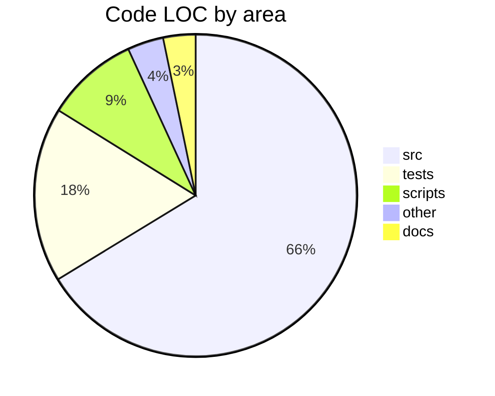
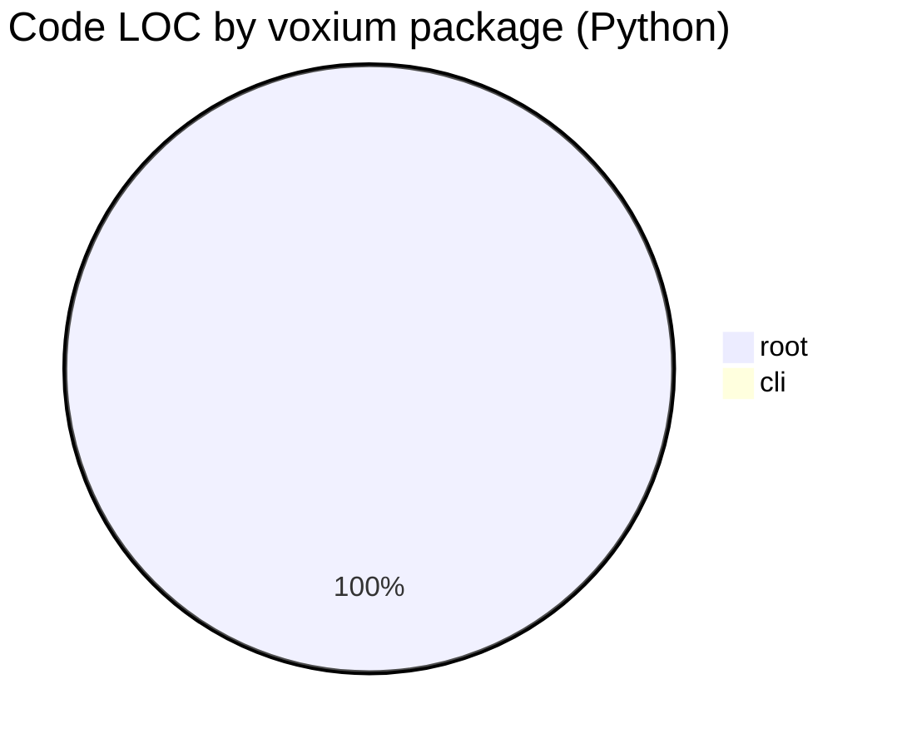

# Repository statistics

> Regenerate: `make repo-stats` (or: `python scripts/generate_repo_stats.py`).

<!-- BEGIN: REPO-STATS -->

## Current stats

- **Code LOC (approx.):** 9,183
- **Total lines (tracked extensions):** 11,083

### LOC by area
| Area | Code LOC | Total lines |
|------|----------|-------------|
| src | 6,087 | 7,105 |
| tests | 1,613 | 2,104 |
| scripts | 853 | 1,016 |
| other | 332 | 452 |
| docs | 298 | 406 |

### Top Python packages
| Package (`src/voxium/`, `.py`) | Code LOC | Total lines |
|----------------------------------|----------|-------------|
| root | 5,977 | 6,985 |
| cli | 7 | 13 |

_Note: “Code LOC” is non-blank lines minus line-leading `#` comments (where applicable for that extension). Python virtualenvs (dirs named `venv/`, `env/`, and any `.venv*`) and runtime data dirs (`models/`, `logs/`, …) are excluded from scans._

<!-- END: REPO-STATS -->

