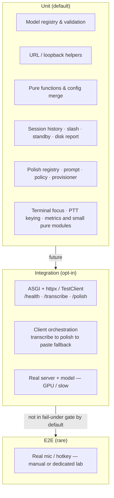
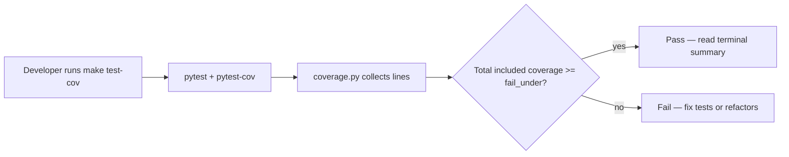

# Testing and coverage

Voxium aims for **high confidence in refactors** and a **repeatable** developer workflow — the same “**ground**” discipline you want before a **PTT** app ships: tests are the **copy** you trust. This document defines the **coverage fail-under** (see `pyproject.toml`), how to run tests, and how to read the **terminal coverage** report. Voice for *why* we test: [brand.md](brand.md). Structure: [architecture.md](architecture.md).

---

## 1. Quality goals

| Goal | Mechanism |
|------|-----------|
| **Line coverage (package scope)** | `coverage.py` with `source = ["src/voxium"]` in `pyproject.toml` (`[tool.coverage.run]`) and `fail_under` in `[tool.coverage.report]`; **`scripts/`** is *not* part of the gate. Used by `make test-cov` (Linux / GNU make; on Windows see [README.md](../README.md)) |
| **Branch coverage** | `branch = true` under `[tool.coverage.run]` |
| **Fast default test run** | `make test` runs **pytest only** (no coverage), suitable for tight loops |
| **Full gate before merge / release** | `make test-cov` (pytest + coverage + fail-under) |
| **Readable omissions** | `# pragma: no cover` for impossible or platform-specific lines (use sparingly) |

**Important:** The **fail-under** value in **`pyproject.toml`** is the **gated** target. Until the suite and omissions satisfy it, `make test` may stay green while `make test-cov` fails; use that signal to add tests. CI should run `test-cov` on **release-oriented** branches.

---

## 2. Test layers



The **`make test-cov` percentage** does **not** include `scripts/` (for example `scripts/mk.py`); only `src/voxium` per `[tool.coverage.run].source`.

- **Unit tests** should be **hermetic**: no real microphone, no real GPU model load unless marked.
- **Integration** tests (HTTP against the real app object, or a very small model on CPU) may use **pytest markers** (see `pyproject.toml` `[tool.pytest.ini_options] markers`) and are **excluded** from the default run if you add `addopts` with `-m "not integration"` later.
- **End-to-end** (pynput + sounddevice) is **hard to automate**; keep it manual or a separate job with hardware.

**Current polish coverage map:**

- **Provisioning / inventory / runtime helpers:** `tests/test_polish_provision.py`, `tests/test_polish_model_registry.py`, `tests/test_llama_cpp_daemon.py`, `tests/test_llama_cpp_client.py`, `tests/test_polish_policy.py`, `tests/test_polish_prompt.py`
- **Server / client behavior:** `tests/test_server_polish.py`, `tests/test_polish_client.py`, `tests/test_server_health.py`
- **Operator command surface:** `tests/test_slash_commands.py`, `tests/test_slash_complete.py`, `tests/test_models_command.py`
- **Client guard rails:** `tests/test_terminal_focus.py` (focus probe for `/`), `tests/test_ptt_keying.py`, `tests/test_constants.py`

The Windows PowerShell wrapper itself is still best validated with a manual smoke run, but the provisioning logic it calls lives in Python and is covered there.

**Coverage scope** (what counts toward the `fail_under` bar) is controlled by **`[tool.coverage.run].source`** (currently `["src/voxium"]`) and **`omit`** in `pyproject.toml` — adjust as the **package** layout changes. The gate does **not** include `scripts/`; development helpers under `scripts/mk.py` and similar stay outside the percentage.

---

## 3. How to run

| Command | Purpose |
|---------|---------|
| `make test` | Pytest only; respects `PYTEST_ARGS` (e.g. `make test PYTEST_ARGS='-vv tests/test_foo.py'`) |
| `make test-cov` | Pytest with **coverage** (per-file/missing lines in the **console**), **fail** if below configured `fail_under` (see `pyproject.toml`; `mk.py` may add extra flags) |
| `make install-dev` | Installs `.[dev]` (includes `pytest-cov`) once (via `.dev-install-stamp`) |

**Useful focused runs for the shipped polish path:**

```bash
pytest -q tests/test_server_polish.py tests/test_polish_client.py
pytest -q tests/test_polish_provision.py tests/test_llama_cpp_daemon.py
pytest -q tests/test_models_command.py tests/test_slash_commands.py tests/test_slash_complete.py
```

**Plain shell (with venv activated):**

```bash
pytest
pytest --cov --cov-config=pyproject.toml --cov-report=term-missing:skip-covered
# add --cov-fail-under=<N> to match [tool.coverage.report] fail_under, or use make test-cov
```

`make test-cov` matches that style (see `scripts/mk.py`); add `--cov-report=html:htmlcov` by hand if you want a **browser** report for a deep dive.

---

## 4. Configuration reference (excerpt)

Relevant sections in **`pyproject.toml`**:

- `[tool.pytest.ini_options]` — `testpaths`, `markers`, `addopts`
- `[tool.coverage.run]` — `source`, `omit`, `branch`
- `[tool.coverage.report]` — `fail_under`, `exclude_lines`, `show_missing`

**Excluding** code from coverage (only when justified):

- Add `# pragma: no cover` to a **line** (e.g. defensive `if TYPE_CHECKING` branches you never execute in tests, or a **Windows-only** branch in a cross-platform helper that CI never runs on Linux).
- Use `exclude_lines` in `[tool.coverage.report]` for **structural** patterns (already includes `pragma: no cover`, `if TYPE_CHECKING:`, etc.).

Avoid blanket `except: pass` without tests or a pragma — that **reduces** real coverage and hides bugs.

---

## 5. Roadmap to full coverage

1. **Cover pure logic first:** `voxium.model_registry`, URL parsing, config merge helpers in `voxium.config` / `voxium.app`.
2. **Mock I/O at boundaries:** HTTP client to `/transcribe` and `/polish` with `responses` or `unittest.mock`; FastAPI with `TestClient` (see `tests/test_server_health.py` and `tests/test_server_polish.py`) or `httpx` `ASGITransport` + `AsyncClient`.
3. **Refactor** large functions in `voxium.app` into testable **pure** helpers + thin adapters (see [architecture.md](architecture.md#4-repository-layout)).
4. **Tighten** coverage `source` / `omit` in `pyproject.toml` as the tree stabilizes under `src/voxium/`. **Today:** the gate is measured on installable code **other than** `voxium.app`, `voxium.whisper_server`, `voxium.console_status`, and `voxium.__main__` (see `omit`; expand tests before removing those lines for interactive modules).
5. **Raise** `fail_under` in CI when the main branch is consistently above the current bar, or use a **staged** threshold with a **documented** end date.

---

## 6. Mermaid: coverage flow



---

## See also

- [README.md](README.md) (documentation index)
- [architecture.md](architecture.md) (components and sequences)
