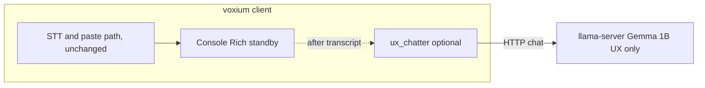

# UX chatter (Gemma) — design and implementation plan

**Status:** Implemented (default **on**; use `voxium run --no-ux-chatter`, `ux_chatter.enabled: false` in `~/.config/voxium/config.yaml`, or `VOXIUM_UX_CHATTER=0` to disable). **Provision:** On first run, the client **auto-pulls** the Gemma GGUF into `models/ux/` when it is missing (override with `--no-ux-chatter-auto-pull` or `ux_chatter.auto_pull: false` in config). You can also run `voxium models --pull-ux-chatter` (HF Gemma access may be gated; accept the license or use `huggingface-cli login`). **Run:** `voxium run` (no extra flag). A **second** local `llama-server` is started on `--ux-chatter-url` when **auto-start** is on and the Gemma file exists under `models/ux/` (separate from re-encode; log: `logs/llama_cpp_ux.log`).  
**Goal:** Add **optional, fun, on-brand** dynamic lines in the **console / Rich** experience, driven by a **small local GGUF** and the latest **transcribed text**, without changing PTT/VOX/transcribe/paste behavior and without new regression risk. **`make test` and `make lint` must pass;** when the feature is off or the model is missing, fall back to static copy.

**References:** [brand.md](brand.md), [radio-chatter-context.md](radio-chatter-context.md), [architecture.md](architecture.md), [llm-polish-plan.md](llm-polish-plan.md).

---

## 1. Product intent

| Aspect | Rule |
|--------|------|
| **Purpose** | “HAM/CB chatter” **flavor** in the **console log / status** area only: witty, short, **radio + Apollo** tone, responsive to **what the user just said** (transcript as context). |
| **Not in scope** | Changing hotkeys, recording logic, **STT output**, **polish** semantics, API shapes, or paste targets. No new user **obligations** to download a model. |
| **Default** | **On**; any error, opt-out, or missing asset → **static strings** (no blank in the panel). |
| **Failure** | Any error, timeout, or missing asset → **fallback to existing hard-coded strings** (no blank, no stack trace in the panel). |

---

## 2. Model: `google/gemma-3-1b-it-qat-q4_0-gguf`

- **Size:** small (≈1B-class QAT GGUF), appropriate for **very short** completions.  
- **Name in ops copy:** e.g. **Gemma (UX)** or **ux-chatter** in config — avoid overloading the word **polish** (that lane stays STT post-edit).

### 2.1 Reuse **llama.cpp** only (no third inference *framework*)

Voxium already uses **`llama-server`** (llama.cpp) for the **polish / re-encode** path via `voxium.llama_cpp_client` and `voxium.llama_cpp_daemon` (see [llm-polish-plan.md](llm-polish-plan.md)).

**Important:** A single `llama-server` process typically serves **one loaded GGUF** at a time (`-m ...`). The **polish** default is a different GGUF (e.g. Qwen) than the proposed **Gemma 1B**. Therefore:

| Approach | Reuse of engine | When to use |
|----------|-----------------|------------|
| **A — Second `llama-server` (recommended baseline)** | Same **binary** as polish; second process on a **separate loopback port** (e.g. `11436` vs polish’s port); **Gemma only** in that process. | Polish and UX can both be “on” without unloading/reloading a multi‑GB model between requests. |
| **B — Same port as polish** | Same process = **one** model loaded. | Implies **either** polish **or** UX model is loaded, or heavy **model swap** between requests — **poor for latency** and **not** recommended. |
| **C — UX only when polish is disabled** | One server, one small model. | Possible **future** simplification; conflicts with “power user runs polish + fun UX” unless (A) exists. |

**Implementation direction:** extend the **same HTTP client** (`llama_cpp_chat` or a thin `ux_chatter_complete` wrapper) with **configurable** `base_url`, `model` id, **system prompt**, `max_tokens`, and `timeout` — not a new HTTP stack. Optionally **factor** a shared “chat completion” helper if polish and UX only differ in prompts and limits.

---

## 3. Guardrails (required)

| Guard | Suggestion (tune in implementation) |
|------|-------------------------------------|
| **Output length** | `max_tokens` very small (e.g. 32–64); then **hard truncate** to **panel width** (e.g. 100–120 chars) with ellipsis. |
| **Wall time** | Short HTTP timeout (e.g. 250–600 ms) for UX; on timeout **fallback string**. |
| **Frequency** | **Debounce** / **cooldown**: e.g. at most one generation per **finished transcript**, or one per N seconds, **not** on every UI tick. |
| **No hot path** | Never **await** UX generation before **paste** or **STT** completion; fire async or “next idle” after the **documented** success path. **Optional:** `threading` / `concurrent.futures` with a **small** thread pool (one worker) if the UI thread must not block — measure and keep GIL impact minimal. |
| **Content** | System prompt: **brand** + small digest of [radio-chatter-context.md](radio-chatter-context.md) (or embedded constant snippet), plus “one line, no profanity, no PII regurgitation, no URLs, no code blocks.” Post-filter strip newlines / repeated spaces. |
| **Cache** | Optional: hash `(slot_id, normalized_transcript_prefix, phase)` to skip duplicate calls. |
| **Telemetry** | **Optional** log at DEBUG: latency, timeout count, fallback count (no user transcript in logs if policy disallows it). |

---

## 4. String surfaces to touch (incremental)

Implement **behind a flag**; wire **one** surface first, then expand.

| Area | Indicative files (current tree) | Notes |
|------|----------------------------------|------|
| Startup / rig | `voxium/startup_banner.py` | Banner and “Rig on station …” type lines. |
| Status / “Standing by” | `voxium/app.py`, `voxium/standby_telemetry.py`, `voxium/console_status.py` | Tests in `tests/test_console_status.py` use **exact** title/subtitle strings — add a **static mode** for tests or assert on **structure** / substring once dynamic mode is default-off in CI. |
| Radio readback | `voxium/radio_readback.py` | Breaker-style lines. |

**Tests:** With feature **off**, all existing tests must pass **unchanged**. For feature **on**, add **new** unit tests (mocked `llama_cpp_*`) for truncation, timeout → fallback, and “no call when cooldown.”

---

## 5. Configuration (sketch)

| Key | Purpose |
|-----|--------|
| `ux_chatter_enabled` (bool, default `False`) | Master switch. |
| `ux_chatter_base_url` | e.g. `http://127.0.0.1:11436` (second `llama-server`) |
| `ux_chatter_model` | Server “model” id (alias for loaded GGUF). |
| `ux_chatter_timeout_s`, `ux_chatter_max_tokens` | Hard limits. |
| Paths | New trusted entry for the **Gemma** GGUF (e.g. under `models/ux/` or `models/polish/` with a **distinct** filename) — TBD: mirror `TrustedPolishModel` pattern in a **small** `ux_chatter_model_registry` or a single row in a shared “local GGUF” table. |

**Env / CLI:** optional `VOXIUM_UX_CHATTER=0` for CI and for users who want zero sidecar traffic.

**Provisioning:** optional `voxium models --ux-chatter` (or combined with Windows bootstrap) to download **only** when the operator opts in — idempotent, like `--pull-polish`.

---

## 6. Architecture (logical)

*(Polish continues to use its own `llama-server` and GGUF; this diagram only shows the optional UX chatter path.)*

Polish path continues to use **its** `llama-server` instance; UX chatter uses **llama.cpp** only, on a **separate** process when both are needed.

---

## 7. Implementation phases (for the coding agent)

1. **Config + registry stub**  
   - Feature flag default off.  
   - Optional trusted GGUF record + repo path (no default download in minimal install).

2. **Second daemon helper (or generalized `ensure` with port + model)**  
   - Reuse `ensure_llama_cpp_*` patterns; **do not** bind polish and UX to the same process without an explicit “single server” mode doc.

3. **Pure helper: `build_ux_chatter_request` / `complete_ux_line`**  
   - Input: transcript snippet, `phase` enum (`standby` | `startup` | `after_tx` …).  
   - Output: short string or `None` → caller uses static default.

4. **Wire one UI slot** (e.g. `standby_telemetry` detail line) with async + timeout + static fallback.

5. **Tests**  
   - Mocks, no real `llama-server` in default `make test`.  
   - Grep/extend `tests/test_console_status.py` only with **static** default or fixture flag.

6. **Docs**  
   - This file + one paragraph in [architecture.md](architecture.md) (optional) when behavior is real.

7. **Optional:** Windows `Setup-Voxium` / `voxium models` to pull Gemma when operator wants full “fun” experience.

---

## 8. Open questions (resolve before or during first PR)

1. **Port:** Fixed second port vs configurable only — is `11436` acceptable, or follow polish port +1 convention?  
2. **Coexistence:** Is **polish + UX** simultaneously in scope for v1? (If **yes**, plan **A** (two `llama-server` processes) is the default; document RAM impact.)  
3. **Trigger set:** **Only** after a **successfully transcribed** line, or also on idle/startup with **empty** context (may need **static** seed lines)?  
4. **Privacy:** Should the UX prompt **never** include the full raw transcript, only a **redacted** or **max-N-char** tail? (Recommended: cap at ~200–400 chars in the prompt.)  
5. **Disk and HF:** exact filename after download and Hugging Face revision pinning for reproducible installs.  
6. **Naming in UI:** “Gemma” / “ux-chatter” in DEBUG logs only vs never expose model names to the operator.  
7. **Internationalization:** English-only v1, or pass-through of operator locale later?

---

## 9. Verification (merge bar)

- `make test`  
- `make lint`  
- Manual: `voxium` / `voxium run` with **flag off** — indistinguishable from pre-feature behavior.  
- With flag on and **no** second server: instant fallback, no hang.  
- Mermaid in this file: use **quoted node labels** for paths, `--`, and parentheses (see [architecture.md](architecture.md) fixes).

---

## 10. Related code map

| Module | Role |
|--------|------|
| `voxium/llama_cpp_client.py` | `llama_cpp_chat`, `llama_cpp_reachable` — **reuse** with different prompts/limits. |
| `voxium/llama_cpp_daemon.py` | `ensure_llama_cpp_daemon` — **pattern** for a second instance. |
| `voxium/polish_model_registry.py` | **Pattern** for trusted GGUF; UX model may be a separate table. |
| `voxium/polish_prompt.py` | **Do not** overload `system_message()` for polish with UX; **separate** `ux_chatter_prompt.py` (or similar). |
| `voxium/startup_banner.py`, `voxium/standby_telemetry.py`, `voxium/radio_readback.py` | Primary **string** injection points. |

This document is the handoff for implementation; keep **defaults safe**, **tests green**, and **one llama.cpp stack** (one or two **processes**, not a new inference engine).
