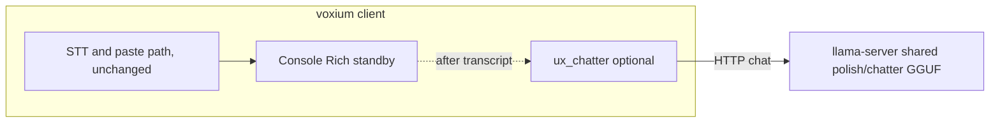

# UX chatter — shared polish model lane

**Status:** Implemented (default **on**; use `voxium run --no-ux-chatter`, `ux_chatter.enabled: false` in `~/.config/voxium/config.yaml`, or `VOXIUM_UX_CHATTER=0` to disable). **Model lane:** UX chatter uses the **same selected polish GGUF** as re-encode, served by the same local `llama-server` on `--llama-cpp-url` and stored under `models/polish/`. Select it with `/models polish use <id>` or `voxium run --polish-model <id>`. **Provision:** use `voxium models polish pull <id>`.

**Goal:** Add **optional, fun, on-brand** dynamic lines in the **console / Rich** experience, driven by the shared local GGUF and the latest **transcribed text**, without changing PTT/VOX/transcribe/paste behavior and without new regression risk. **`make test` and `make lint` must pass;** when the feature is off or the model is missing, fall back to static copy.

**References:** [brand.md](brand.md), [radio-chatter-context.md](radio-chatter-context.md), [architecture.md](architecture.md), [llm-polish-plan.md](llm-polish-plan.md).

---

## 1. Product intent

| Aspect | Rule |
|--------|------|
| **Purpose** | “HAM/CB chatter” **flavor** in the **console log / status** area only: witty, short, **radio + new-space-race / coding-agents** tone, responsive to **what the user just said** (transcript as context). |
| **Not in scope** | Changing hotkeys, recording logic, **STT output**, **polish** semantics, API shapes, or paste targets. No new user **obligations** to download a model. |
| **Default** | **On**; any error, opt-out, or missing asset → **static strings** (no blank in the panel). |
| **Failure** | Any error, timeout, or missing asset → **fallback to existing hard-coded strings** (no blank, no stack trace in the panel). |

---

## 2. Model lane: `models/polish/`

- **Selection:** the active `--polish-model` is also the UX chatter model. `auto` resolves to the registry default in `voxium.polish_model_registry`.
- **Gemma option:** `gemma-2-2b-it-q5km` (`gemma-2-2b-it-Q5_K_M.gguf`) is available as a trusted shared polish/chatter model.
- **Name in ops copy:** say **polish/chatter model lane** or **shared local GGUF**. Do not imply there is a separate active UX model.

### 2.1 Reuse **llama.cpp** only (no third inference *framework*)

Voxium uses **one** `llama-server` process for the shared **polish / re-encode / UX chatter** path via `voxium.llama_cpp_client` and `voxium.llama_cpp_daemon` (see [llm-polish-plan.md](llm-polish-plan.md)). A single `llama-server` serves one loaded GGUF at a time, so the product rule is simple: **chatter and polish always use the same selected model**.

The UX path still has its own prompts, short timeouts, and fallbacks. It does **not** have its own model registry, model directory, or active port.

---

## 3. Guardrails (required)

| Guard | Suggestion (tune in implementation) |
|------|-------------------------------------|
| **Output length** | `max_tokens` very small (e.g. 32–64); then **hard truncate** to **panel width** (e.g. 100–120 chars) with ellipsis. |
| **Wall time** | Short HTTP timeout (e.g. 250–600 ms) for UX; on timeout **fallback string**. |
| **Frequency** | **Debounce** / **cooldown**: e.g. at most one generation per **finished transcript**, or one per N seconds, **not** on every UI tick. |
| **No hot path** | Never **await** UX generation before **paste** or **STT** completion; fire async or “next idle” after the **documented** success path. **Optional:** `threading` / `concurrent.futures` with a **small** thread pool (one worker) if the UI thread must not block — measure and keep GIL impact minimal. |
| **Content** | System prompt: **brand** + small digest of [radio-chatter-context.md](radio-chatter-context.md) (or embedded constant snippet), plus “one line, no profanity, no PII regurgitation, no URLs, no code blocks.” Post-filter strip newlines / repeated spaces. |
| **Cache** | Optional: hash `(slot_id, normalized_transcript_prefix, phase)` to skip duplicate calls. |
| **Telemetry** | **Optional** log at DEBUG: latency, timeout count, fallback count (no user transcript in logs if policy disallows it). |

---

## 4. String surfaces to touch (incremental)

Implement **behind a flag**; wire **one** surface first, then expand.

| Area | Indicative files (current tree) | Notes |
|------|----------------------------------|------|
| Startup / rig | `voxium/startup_banner.py` | Banner and “Rig on station …” type lines. |
| Status / “Standing by” | `voxium/app.py`, `voxium/standby_telemetry.py`, `voxium/console_status.py` | Tests in `tests/test_console_status.py` use **exact** title/subtitle strings — add a **static mode** for tests or assert on **structure** / substring once dynamic mode is default-off in CI. |
| Radio readback | `voxium/radio_readback.py` | Breaker-style lines. |

**Tests:** With feature **off**, all existing tests must pass **unchanged**. For feature **on**, add **new** unit tests (mocked `llama_cpp_*`) for truncation, timeout → fallback, and “no call when cooldown.”

---

## 5. Configuration

| Key | Purpose |
|-----|--------|
| `ux_chatter.enabled` (bool, default `True`) | Master switch for console-only chatter. |
| `server.llama_cpp_url` | Shared polish/chatter `llama-server` base URL. |
| `transcription.polish_model` | Shared model id for polish and UX chatter. |
| `ux_chatter.base_url`, `ux_chatter.model` | Optional overrides for chatter HTTP only; when unset, `server.llama_cpp_url` and `transcription.polish_model` apply. |
| `ux_chatter.timeout_s`, `ux_chatter.max_tokens` | Hard limits for chatter requests. |
| Paths | Trusted GGUFs live under `models/polish/` and are listed by `/models polish list`. |

**Env / CLI:** use `VOXIUM_UX_CHATTER=0` for CI or for operators who want zero chatter traffic. `voxium run --no-ux-chatter` disables the chatter surfaces while leaving the shared polish model lane available.

**Provisioning:** `voxium models polish pull <id>` downloads a shared GGUF.

---

## 6. Architecture (logical)

Polish and UX chatter share the same `llama-server` instance and selected GGUF. The STT server remains separate.

---

## 7. Current operator behavior

1. **One shared lane:** `/models polish use <id>` and `voxium run --polish-model <id>` switch the model used for both re-encode and UX chatter.

2. **One shared runtime:** `server.llama_cpp_url` / `--llama-cpp-url` is the default base URL for both paths. Optional `ux_chatter.base_url` overrides the chatter HTTP client only when you need a different loopback endpoint than re-encode.

3. **One active GGUF at a time:** when the selected polish model changes, Voxium rebinds chatter to the same loaded model. There is no separate active UX model or UX-only port.

4. **Graceful fallback:** if chatter is disabled, the shared runtime is unavailable, or a request times out, the console falls back to static on-brand copy and the STT/paste path stays unchanged.

5. **Provisioning:** operators inspect and install the shared lane with `voxium models polish list`, `voxium models polish installed`, and `voxium models polish pull <id>`.

---

## 8. Verification

- `make test`  
- `make lint`  
- Manual: `voxium` / `voxium run` with `--no-ux-chatter` keeps the pre-chatter operator experience except for the shared runtime/model controls.
- Manual: switch models with `/models polish use <id>` and confirm chatter follows the newly selected model without a separate UX startup path.
- Manual: with chatter on and the shared `llama-server` unavailable, the UI falls back immediately without blocking STT or paste.

---

## 9. Related code map

| Module | Role |
|--------|------|
| `voxium/llama_cpp_client.py` | `llama_cpp_chat`, `llama_cpp_reachable` — **reuse** with different prompts/limits. |
| `voxium/llama_cpp_daemon.py` | `ensure_llama_cpp_daemon` — manages the shared local `llama-server`. |
| `voxium/polish_model_registry.py` | Trusted GGUF registry for the shared polish/chatter lane. |
| `voxium/polish_prompt.py` | **Do not** overload `system_message()` for polish with UX; **separate** `ux_chatter_prompt.py` (or similar). |
| `voxium/startup_banner.py`, `voxium/standby_telemetry.py`, `voxium/radio_readback.py` | Primary **string** injection points. |

This document reflects the shipped shared-lane design: **one active GGUF**, **one local `llama-server` lane** for polish plus chatter, and safe fallbacks when that lane is unavailable.
